总操做流程：
- 1、[购买](#vultr-01)
- 2、[创建服务器](#vultr-02)
- 3、[看效果](#vultr-03)

***

# <a name="vultr-01" href="#" >购买</a>

> 1、进入登录界面

[](https://www.vultr.com/promo/try50/?service=try50)


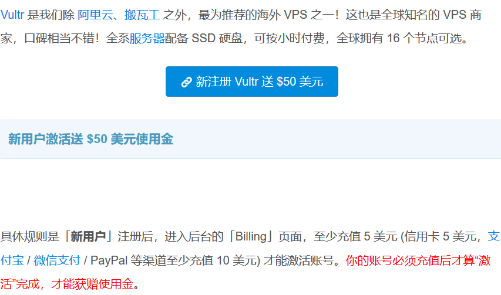

> 2、创建账号充值

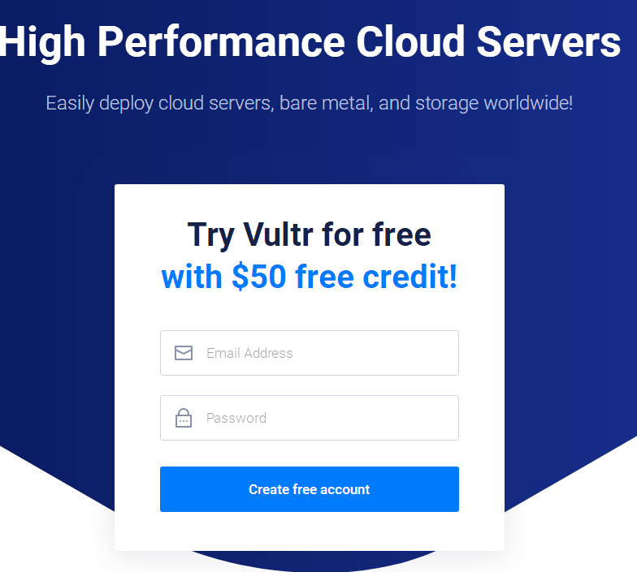

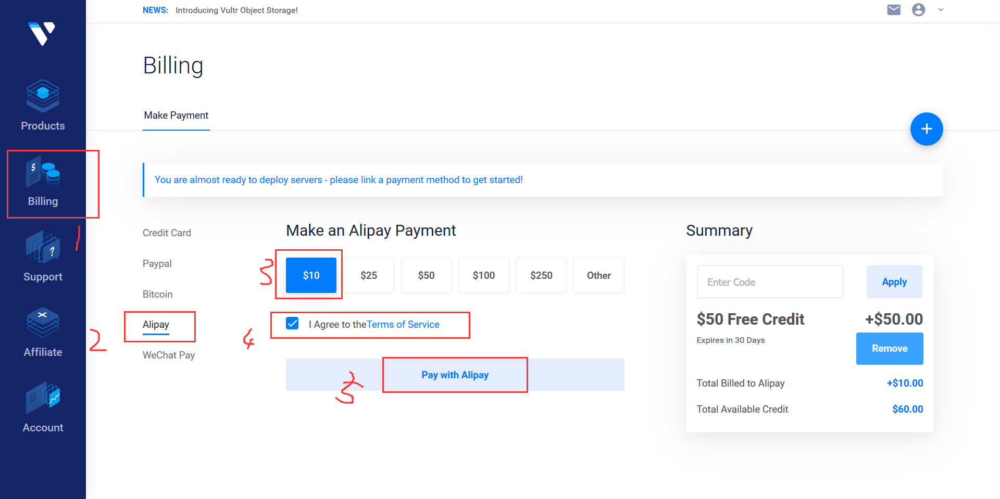

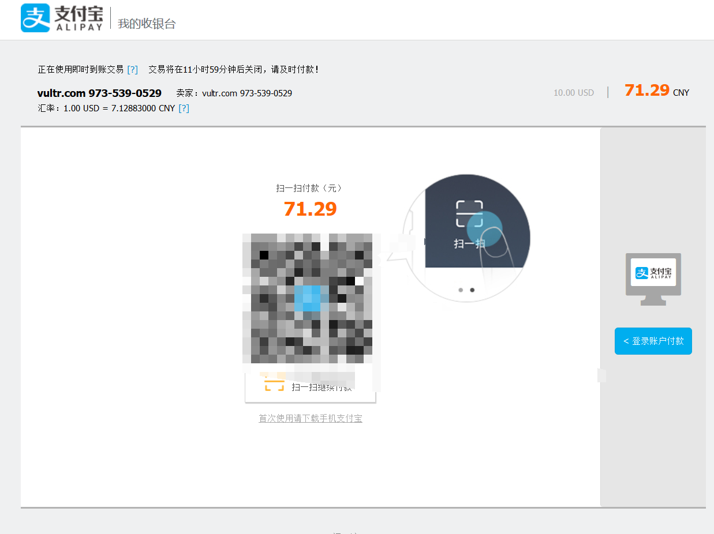

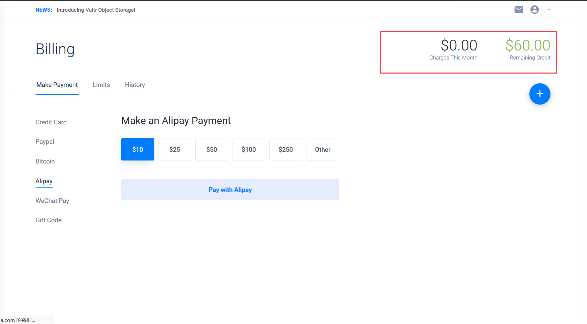

# <a name="vultr-02" href="#" >创建服务器</a>


- 移动用户选择建议：

```
移动用户可选择Vultr的日本节点，或者新加坡节点。
```

- 联通用户选择建议：

```
联通用户可选择Vultr的新加坡节点，也可以尝试Vultr的杉矶机房、硅谷机房和西雅图机房，这几个机房对于联通用户来说速度都很不错。
```

- 电信用户选择建议：

```
电信用户可选择Vultr的洛杉矶机房、硅谷机房和西雅图机房，不推荐日本和新加坡节点。
```

`我选洛杉矶机房`

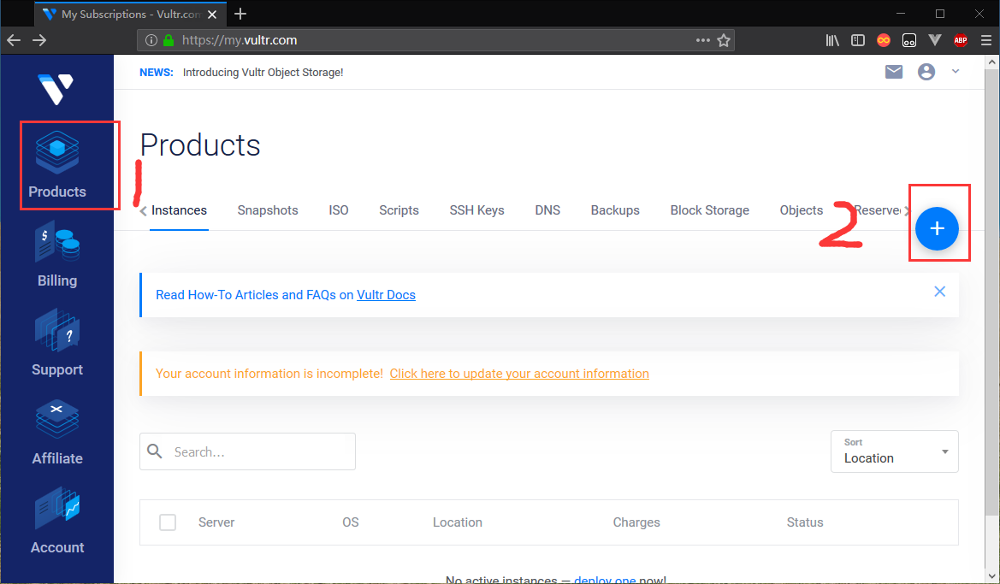

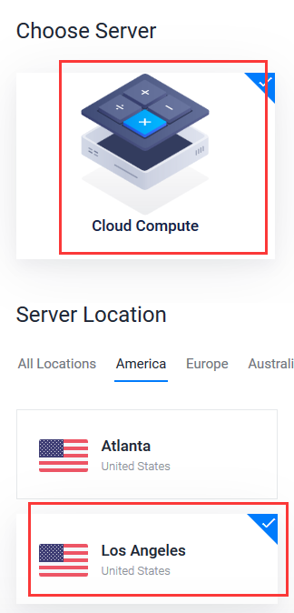

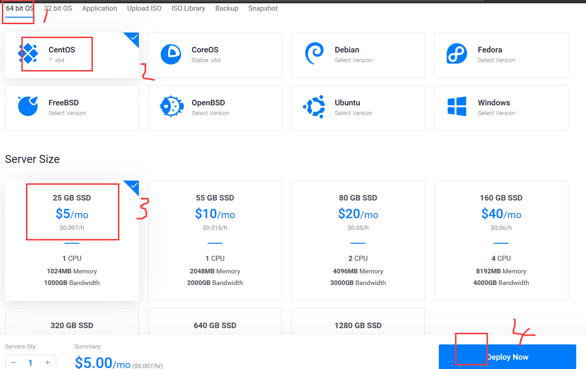


# <a name="vultr-03" href="#" >看效果</a>

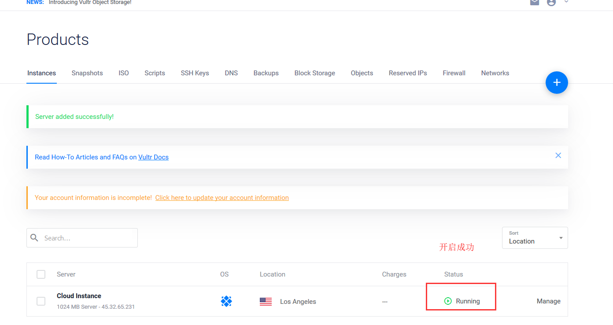

- 记住ip、账号和密码

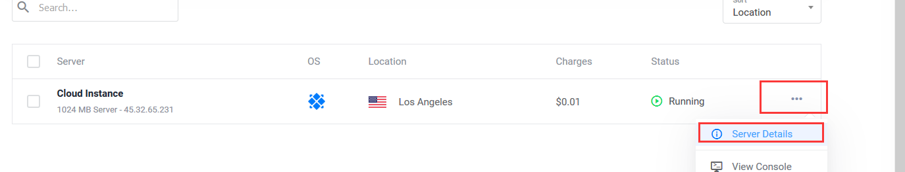

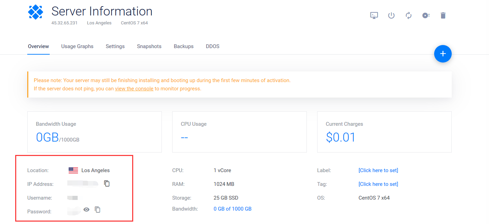