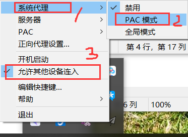

总操作流程：
- 1、[登录安装](#vultr-01)
- 2、[配置](#vultr-02)
- 3、[测试](#vultr-03)

***
# <a name="vultr-01" href="#" >登录安装</a>

> 1、使用ssh远程登录
> 2、安装
```
yum install python-setuptools && easy_install pip 

pip install shadowsocks

pip show shadowsocks
```

# <a name="vultr-02" href="#" >配置</a>

> 1、shadowsocks配置
```
mkdir /etc/shadowsocks
vi /etc/shadowsocks/shadowsocks.json
```

- 单用户的配置
```
{ 
 "server":"xxx.xxx.xxx.xxx",
 "server_port":1698,
 "local_address":"127.0.0.1",
 "local_port":1080,
 "password":"xxxx", 
 "timeout":300,
 "method":"aes-256-cfb",
 "fast_open":false 
 }
```
- 多用户的配置

```
{ 
   "server":"xxx.xxx.xxx.xxx", 
   "port_password":
   {
     "1698":"xxx", 
     "1678":"xxx",
     "1688":"xxx" 
   },
   "timeout":300,
   "method":"aes-256-cfb",
   "fast_open":false
 }
```

```
chmod +x /etc/shadowsocks/shadowsocks.json


```

- 开机自启

```
vi /etc/systemd/system/shadowsocks.service
```

```
[Unit]
Description=Shadowsocks

[Service]
TimeoutStartSec=0
ExecStart=/usr/bin/ssserver -c /etc/shadowsocks/shadowsocks.json

[Install]
WantedBy=multi-user.target
```

```
systemctl stop shadowsocks
systemctl enable shadowsocks
systemctl start shadowsocks
systemctl status shadowsocks -l
```

- 提高最大连接数

```
vi /etc/security/limits.conf
```

```
* soft nofile 51200
* hard nofile 51200
```

- 调整内核参数

```
vi /etc/sysctl.conf
```

`添加`

```
fs.file-max = 51200
net.core.rmem_max = 67108864
net.core.wmem_max = 67108864
net.core.netdev_max_backlog = 250000
net.core.somaxconn = 4096
net.ipv4.tcp_syncookies = 1
net.ipv4.tcp_tw_reuse = 1
net.ipv4.tcp_tw_recycle = 0
net.ipv4.tcp_fin_timeout = 30
net.ipv4.tcp_keepalive_time = 1200
net.ipv4.ip_local_port_range = 10000 65000
net.ipv4.tcp_max_syn_backlog = 8192
net.ipv4.tcp_max_tw_buckets = 5000
net.ipv4.tcp_fastopen = 3
net.ipv4.tcp_mem = 25600 51200 102400
net.ipv4.tcp_rmem = 4096 87380 67108864
net.ipv4.tcp_wmem = 4096 65536 67108864
net.ipv4.tcp_mtu_probing = 1
net.ipv4.tcp_congestion_control = hybla
```

```
sysctl -p
```

- 启动

```
ssserver -c /etc/shadowsocks/shadowsocks.json -d start
```

`停止命令`

```
ssserver -c /etc/shadowsocks/shadowsocks.json -d stop
```

> 2、开启防火墙

```
firewall-cmd --state
systemctl start firewalld
firewall-cmd --zone=public --add-port=1698/tcp --permanent
firewall-cmd --reload
firewall-cmd --list-ports
```

>3、安装BBR加速

```
wget --no-check-certificate https://github.com/teddysun/across/raw/master/bbr.sh

sh ./bbr.sh
```

- 查看内核版本是否 > 4.9 

```
查看内核版本是否 > 4.9 
```

- 查看是否返回 ...reno cubic bbr

```
sysctl net.ipv4.tcp_available_congestion_control 
```

- 查看是否返回... = fq

```
net.core.default_qdisc = fq
```

- 返回值有tcp_bbr 即已启动

```
lsmod | grep bbr
```

# <a name="vultr-03" href="#" >测试</a>

> 1、下载安装Shadowsocks客户端

[](https://github.com/shadowsocks/shadowsocks-windows/releases)




