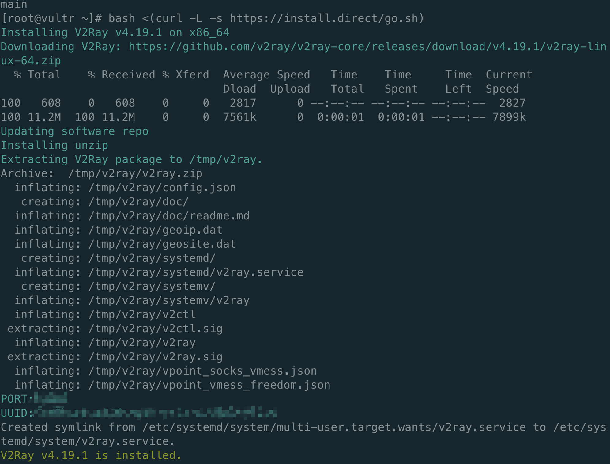
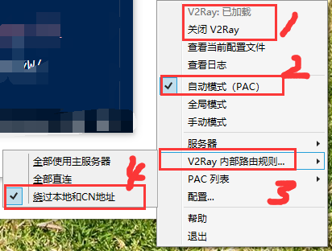
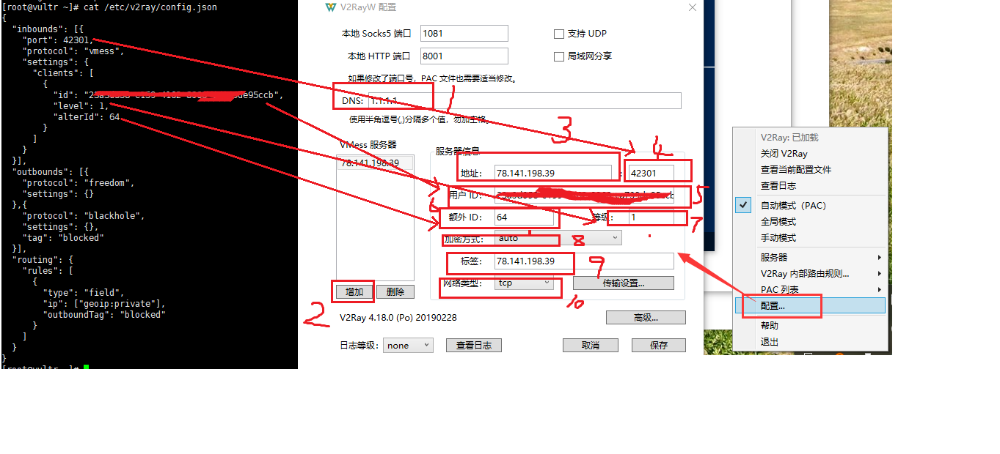

总操作流程：
- 1、[下载安装](#vultr-01)
- 2、[配置](#vultr-02)
- 3、[测试](#vultr-03)

***

# <a name="vultr-01" href="#" >下载安装</a>

> centso7 安装v2ray

```shell
bash <(curl -L -s https://install.direct/go.sh)

service v2ray start

```



> 2、锐速安装

```shell
wget --no-check-certificate -O rskernel.sh https://raw.githubusercontent.com/hombo125/doubi/master/rskernel.sh && bash rskernel.sh
```
- 自动重启后(安装时全部默认，一切按回车)

```shell
yum install net-tools -y && wget --no-check-certificate -O appex.sh https://raw.githubusercontent.com/0oVicero0/serverSpeeder_Install/master/appex.sh && bash appex.sh install
```

> 客户端安装

- windows

[](https://github.com/Cenmrev/V2RayW/releases)

- 安卓

[](https://pan.baidu.com/s/1x3VgIs54ip0q1KsJvSuKPg)

# <a name="vultr-02" href="#" >配置</a>

> 开放防火墙

```shell

firewall-cmd --permanent --zone=public --add-port=42301/tcp
firewall-cmd --reload
firewall-cmd --zone=public --query-port=42301/tcp
```

> windows的客户端配置




```shell
cat /etc/v2ray/config.json
```



> 安卓的客户端


- 客户端的配置

| 项目 | 值 |
| :- | :- |  
| 主机/服务器/地址 | 服务器ip |
| 端口 port | 图中的PORT |
| 用户ID | 图中的UUID |
| 额外ID AlterId | 64 |
| 加密方式 security | auto |
| 用户等级 | 1 |
| 网络/传输协议 network | tcp |
| 加密方式 | none |
| Mux | 开启 |
| 远程路由/DNS (可选) | 1.1.1.1 |
| 路由 | BifrsotV:绕过局域网和中国大陆地址与网站;V2RayN:参数设置-绕过中国大陆地址和ip(这一步的目的是直连国内网站，降低延迟) |


# <a name="vultr-03" href="#" >测试</a>

进入YouTube

https://www.youtube.com
