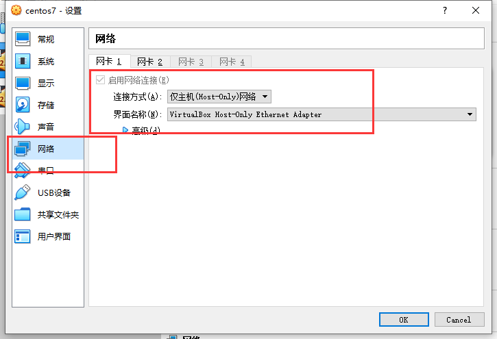
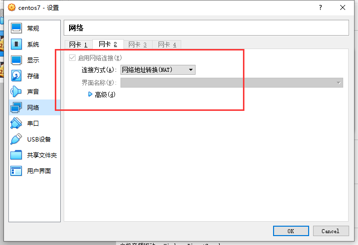
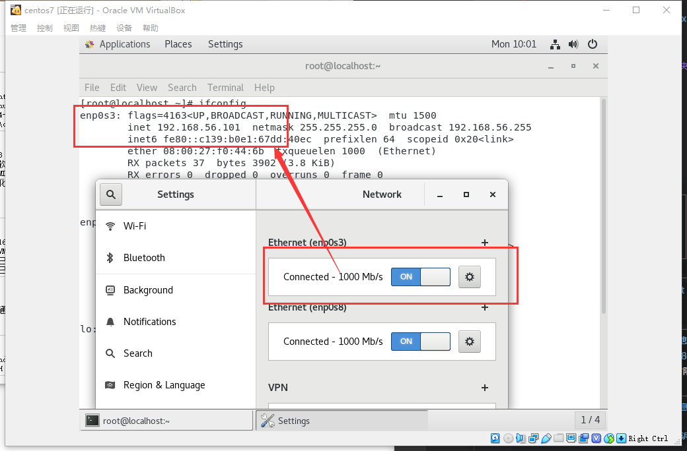
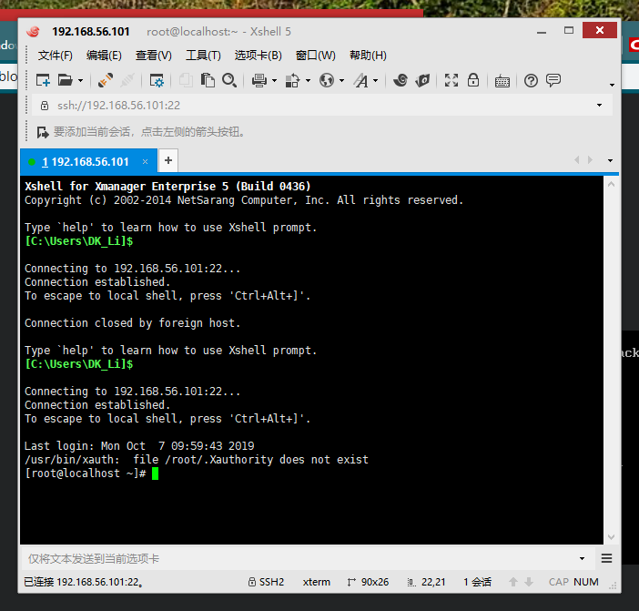

总操作流程：
- 1、[虚拟机配置网络](#VirtualBox-01)
- 2、[系统开启网络](#VirtualBox-02)
- 3、[测试](#VirtualBox-03)

***

# <a name="VirtualBox-01" href="#" >虚拟机配置网络</a>

# <a name="VirtualBox-02" href="#" >系统开启网络</a>

# <a name="VirtualBox-03" href="#" >测试</a>

