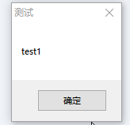

# 效果



# 操作

> 打开编辑器


> 写代码

- 写接口

```java
#include-once

Func test()
   MsgBox(0, "测试","test2")
EndFunc
```

- 写引用接口的主文件

```java
#include "test2.au3"

MsgBox(0, "测试","test1")
test()
```

> 运行


