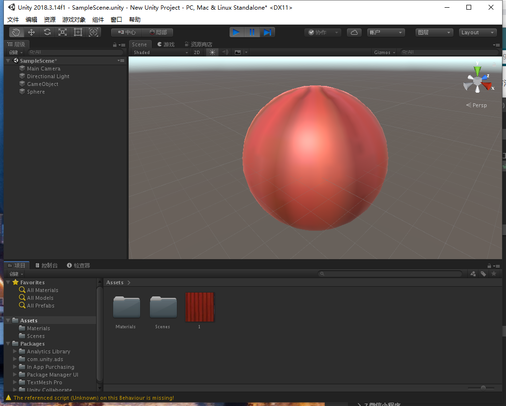
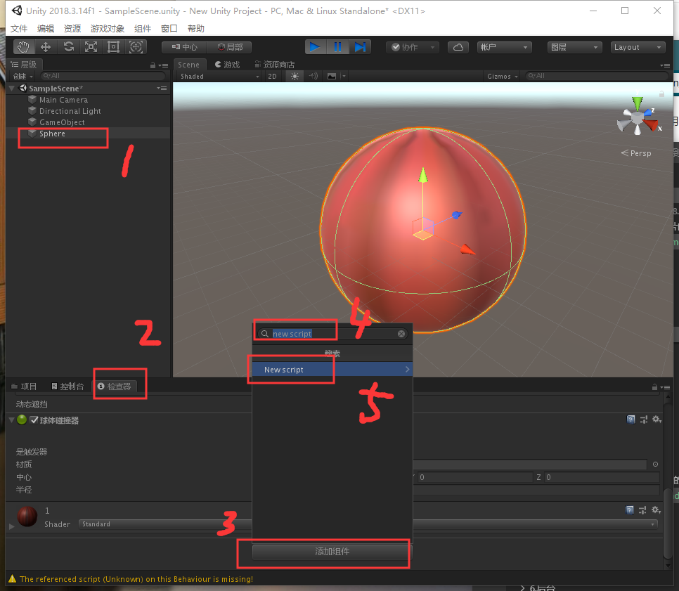
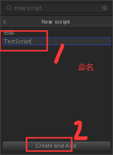
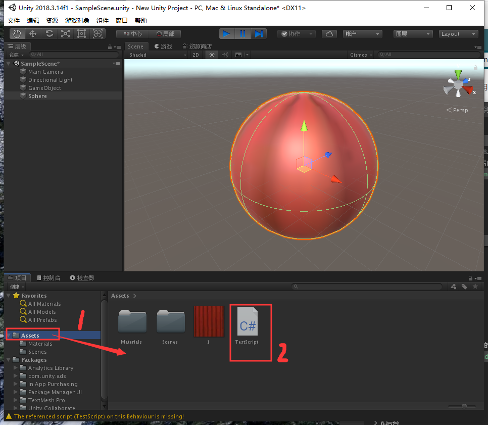
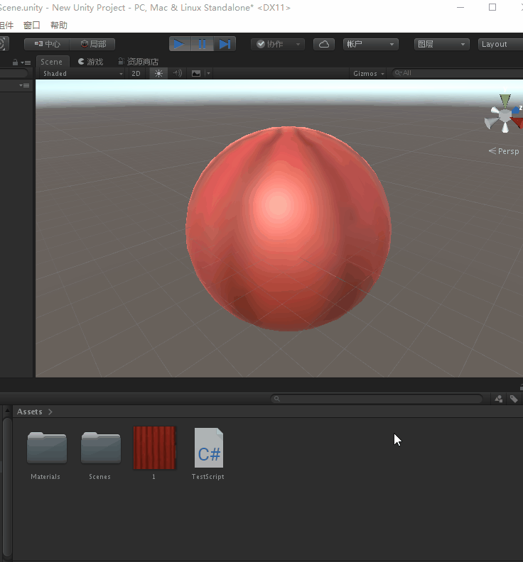

总操作流程
- 1、[创建圆方体](#unity-01)
- 2、[写程序](#unity-02)
- 3、[看效果](#unity-03)

***

# <a name="unity-01" href="#" >创建圆方体</a>




# <a name="unity-02" href="#" >写程序</a>

> 1、创建脚本文件



```shell
New Script
```





> 2、写程序

```c#
using System.Collections;
using System.Collections.Generic;
using UnityEngine;

public class TestScript : MonoBehaviour
{
    // Start is called before the first frame update
    void Start()
    {
        
    }

    // Update is called once per frame
    void Update()
    {
        transform.Rotate (Vector3.up * 100 * Time.deltaTime);
    }
}
```
- start()  : 该方法相当于是初始化(仅执行一次)
- update() : 该方法循环执行，并且以每秒执行n次的速度，速度的快与慢取决于硬件的能力。

> 3、将写好的脚本拖进对象

# <a name="unity-03" href="#" >看效果</a>



