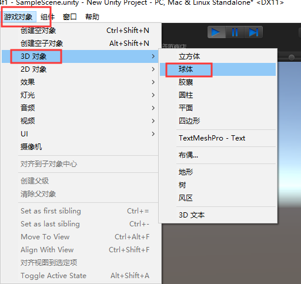
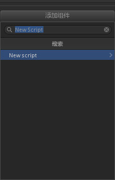
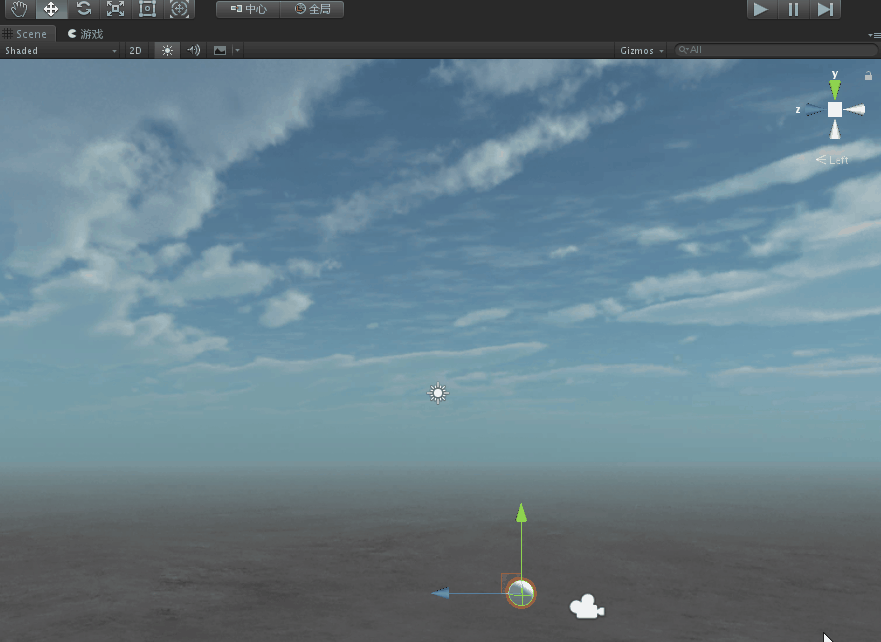

总操作流程
- 1、[创建圆方体](#unity-01)
- 2、[写程序](#unity-02)
- 3、[看效果](#unity-03)

***

# <a name="unity-01" href="#" >创建圆方体</a>




# <a name="unity-02" href="#" >写程序</a>

> 1、创建脚本文件

```shell
New Script
```




> 2、写程序

```java
using System.Collections;
using System.Collections.Generic;
using UnityEngine;

public class TestScript : MonoBehaviour
{
    // Start is called before the first frame update
    void Start()
    {
        
    }
    private Color a;
    public Color b = new Color(0, 55, 255);

    void Update () {
        a = GetComponent<Renderer>().material.color;//自身颜色
        if (Input.GetMouseButtonDown(0)) {
            StartCoroutine("clickChange");
        }
    }

    IEnumerator clickChange() {
        while(GetComponent<Renderer>().material.color != b)
        {
            GetComponent<Renderer>().material.color = Color.Lerp(a, b, 0.5f * Time.deltaTime);
            yield return 0;
        }
        GetComponent<Renderer>().material.color = new Color(0,55,255);
    }
}
```

# <a name="unity-03" href="#" >看效果</a>

