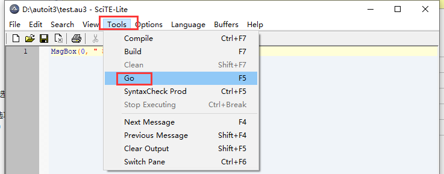

# 效果


# 操作

> 打开编辑器


> 代码

```java
#include <GUIConstantsEx.au3>

; 定義
Dim $yesButton,$noButton,$getFile
Dim $nameInput,$passwordInput,$fileInput
Dim $nameLength,$positioning

loginMainFunc()


; 界面的函數
Func loginMainFunc()
   GUICreate("登陸界面", 400, 200)

   GUICtrlCreateLabel("賬    號:", 40, 60)
   $nameInput=GUICtrlCreateInput("", 100, 57, 250)
   ControlFocus("","",$nameInput)
   $positioning=1
   GUICtrlCreateLabel("密    碼:", 40, 90)
   $passwordInput=GUICtrlCreateInput("", 100, 87, 250)
   HotKeySet("{ENTER}","sendEventFunc")
   GUICtrlCreateLabel("文件路徑:", 40, 120)
   $fileInput=GUICtrlCreateInput("", 100, 117, 200)

   $getFile=GUICtrlCreateButton("獲取", 300, 116, 50)
   $yesButton = GUICtrlCreateButton("確定", 280, 170, 50)
   $noButton = GUICtrlCreateButton("取消", 338, 170, 50)

   GUISetState(@SW_SHOW)
   loginButtonEventFunc()

EndFunc

; 按鈕事件函數
Func loginButtonEventFunc()
   While 1
	 $msg = GUIGetMsg()
	 Select
	   Case $msg = $yesbutton
		 IF StringLen(GUICtrlRead($nameInput))==0 OR StringLen(GUICtrlRead($passwordInput))==0 OR StringLen(GUICtrlRead($fileInput))==0 Then
			MsgBox(16, "警告","輸入框不能爲空~")
		 Else

			ExitLoop
		 EndIf
	   Case $msg = $nobutton
		 ExitLoop
	   Case $msg = $GUI_EVENT_CLOSE
		 ExitLoop
	  Case $msg = $getFile
		 ControlFocus("","",$fileInput)
	 EndSelect
   WEnd
EndFunc

; 鍵盤事件的函數
Func sendEventFunc()
   Select
      Case $positioning=1
		 ControlFocus("","",$passwordInput)
		 $positioning=2
	  Case $positioning=2
		 ControlFocus("","",$fileInput)
		 $positioning=3
	  Case $positioning=3
		 ControlFocus("","",$nameInput)
		 $positioning=1
   EndSelect

EndFunc
```

> 运行

