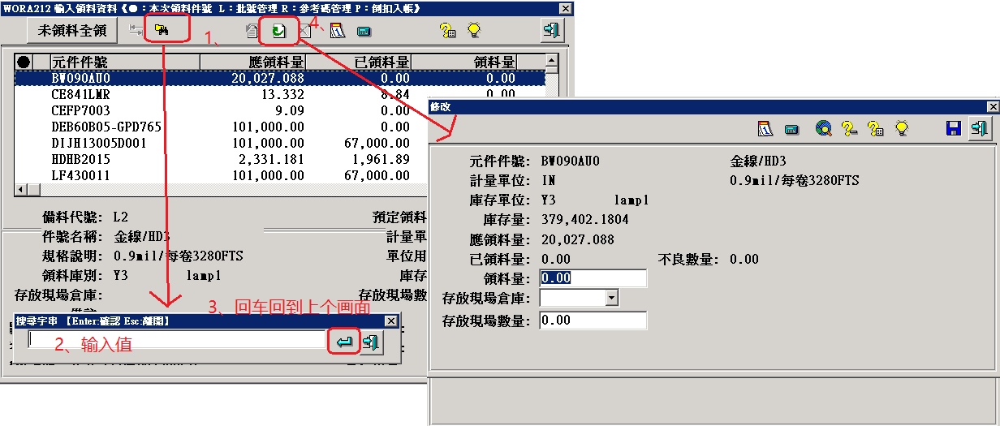

# 应用场景

```
同一个界面下，先点击查询按钮，查詢到数据后，再点击修改按钮
```



# 代码实现

```java
;等待界面激活
WinWaitActive("[CLASS:ProFrame]","",10)
Sleep(1000)
;获取窗口的内部句柄
Local $handle =WinGetHandle("[CLASS:ProFrame]","")
Sleep(1000)
;点击查詢按钮
ControlClick($handle,"","[CLASS:ProButton;instance:8]","")
Sleep(1000)
;输入值，并且回车
ControlSend("[CLASS:ProFrame]","","[CLASS:Edit;instance:1]", $sResultH & @CR )
Sleep(1000)
;点击修改按钮
ControlClick($handle,"","[CLASS:ProButton;instance:6]")
Sleep(1000)
```