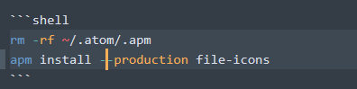
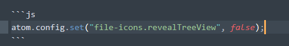
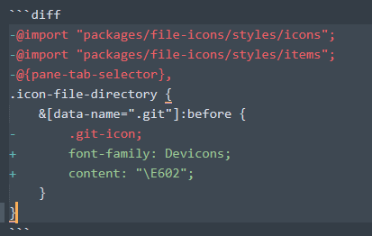
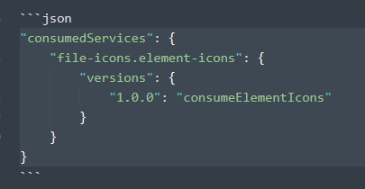
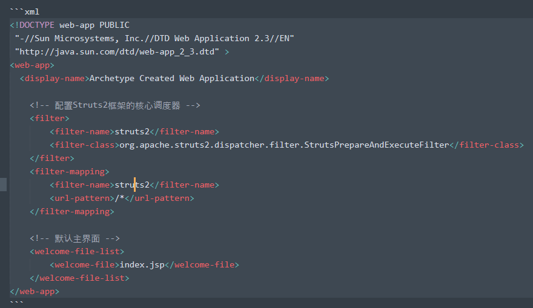
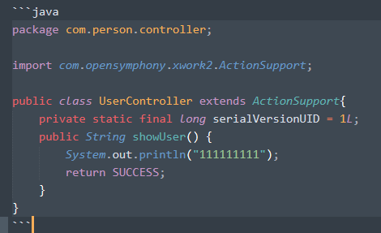

# 本页目录
- 1、[普通块代码](#Markdown-01)
- 2、[css专用块代码](#Markdown-02)
- 3、[less专用块代码](#Markdown-03)
- 4、[shell专用块代码](#Markdown-04)
- 5、[js专用块代码](#Markdown-05)
- 6、[diff专用块代码（对比）](#Markdown-06)
- 7、[json专用块代码](#Markdown-07)
- 8、[xml专用块代码](#Markdown-08)
- 9、[html专用块代码](#Markdown-09)
- 10、[java专用块代码](#Markdown-10)

***

# <a name="Markdown-01" href="#" >普通块代码</a>
- 效果展现：
```
q
e
```

- 语法：


# <a name="Markdown-02" href="#" >css专用块代码</a>

- 效果展现：
```css
.php-icon:before{
    font-family: MFizz;
    content: "\f147";
}
```

- 语法：


# <a name="Markdown-03" href="#" >less专用块代码</a>

- 效果展现：

```less
.directory > .header > .icon{
    &[data-path$=".atom/packages"]:before{
        font-family: "Octicons Regular";
        content: "\f0c4";
    }
}
```

- 语法：


# <a name="Markdown-04" href="#" >shell专用块代码</a>

- 效果展现：

```shell
rm -rf ~/.atom/.apm
apm install --production file-icons
```

- 语法：



# <a name="Markdown-05" href="#" >js专用块代码</a>

- 效果展现：

```js
atom.config.set("file-icons.revealTreeView", false);
```

- 语法：



# <a name="Markdown-06" href="#" >diff专用块代码（对比）</a>

- 效果展现：

```diff
-@import "packages/file-icons/styles/icons";
-@import "packages/file-icons/styles/items";
-@{pane-tab-selector},
.icon-file-directory {
    &[data-name=".git"]:before {
-       .git-icon;
+       font-family: Devicons;
+       content: "\E602";
    }
}
```

- 语法：



# <a name="Markdown-07" href="#" >json专用块代码</a>

- 效果展现：

```json
"consumedServices": {
    "file-icons.element-icons": {
        "versions": {
            "1.0.0": "consumeElementIcons"
        }
    }
}
```

- 语法：



# <a name="Markdown-08" href="#" >xml专用块代码</a>

- 效果展现：

```xml
<!DOCTYPE web-app PUBLIC
 "-//Sun Microsystems, Inc.//DTD Web Application 2.3//EN"
 "http://java.sun.com/dtd/web-app_2_3.dtd" >
<web-app>
  <display-name>Archetype Created Web Application</display-name>
    
    <!-- 配置Struts2框架的核心调度器 -->
    <filter>
        <filter-name>struts2</filter-name>
        <filter-class>org.apache.struts2.dispatcher.filter.StrutsPrepareAndExecuteFilter</filter-class>
    </filter>
    <filter-mapping>
        <filter-name>struts2</filter-name>
        <url-pattern>/*</url-pattern>
    </filter-mapping>
    
    <!-- 默认主界面 -->
    <welcome-file-list>
        <welcome-file>index.jsp</welcome-file>
    </welcome-file-list>
</web-app>
```

- 语法：



# <a name="Markdown-09" href="#" >html专用块代码</a>

- 效果展现：

```html
<%@ page contentType="text/html; charset=UTF-8" pageEncoding="UTF-8"%>

<!DOCTYPE html PUBLIC "-//W3C//DTD HTML 4.01 Transitional//EN" "http://www.w3.org/TR/html4/loose.dtd">
<html>
<body>
    <h2>第一页</h2>
    <form action="toShow">
         <input type="submit" value="提交">
    </form>
</body>
</html>
```

- 语法：


# <a name="Markdown-10" href="#" >java专用块代码</a>

- 效果展现：

```java
package com.person.controller;

import com.opensymphony.xwork2.ActionSupport;

public class UserController extends ActionSupport{
    private static final long serialVersionUID = 1L; 
    public String showUser() {
        System.out.println("111111111");
        return SUCCESS;  
    }
}
```

- 语法：

