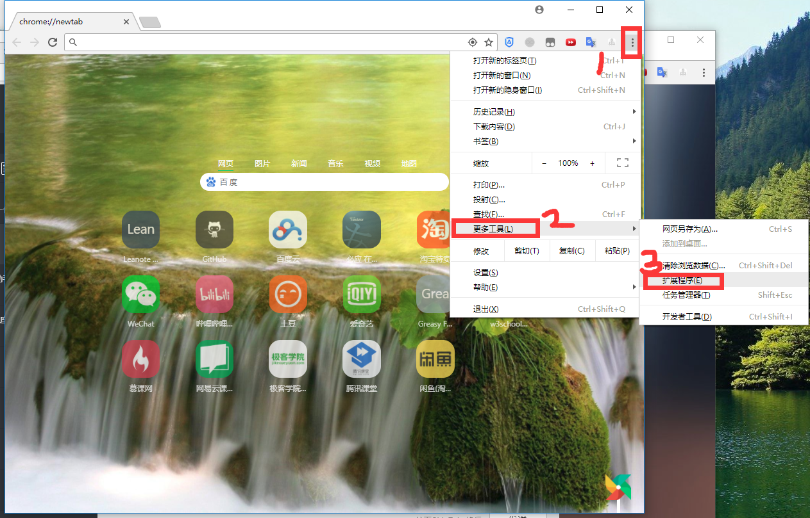
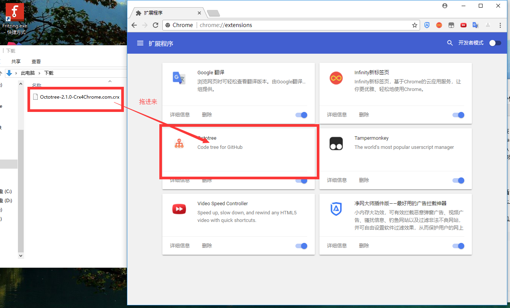
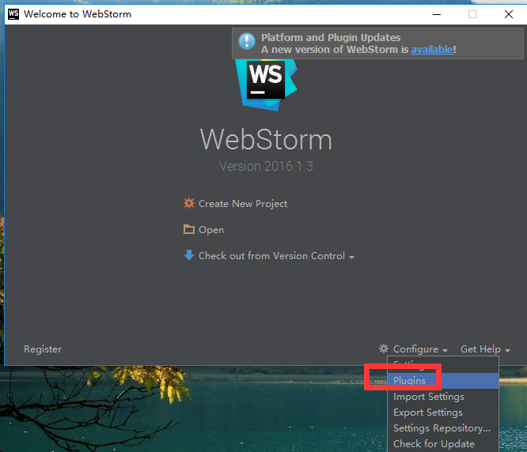
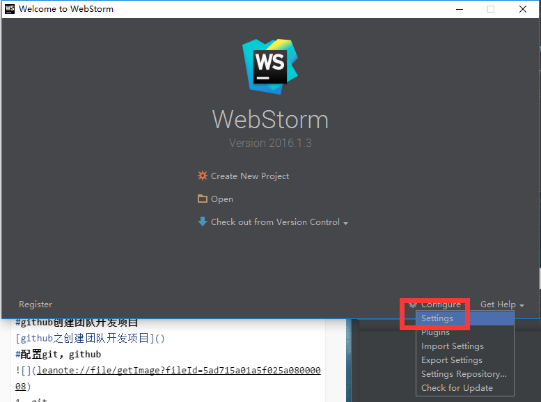
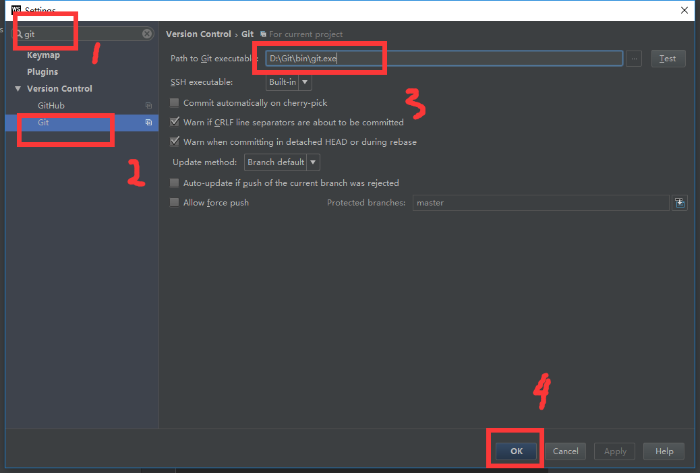
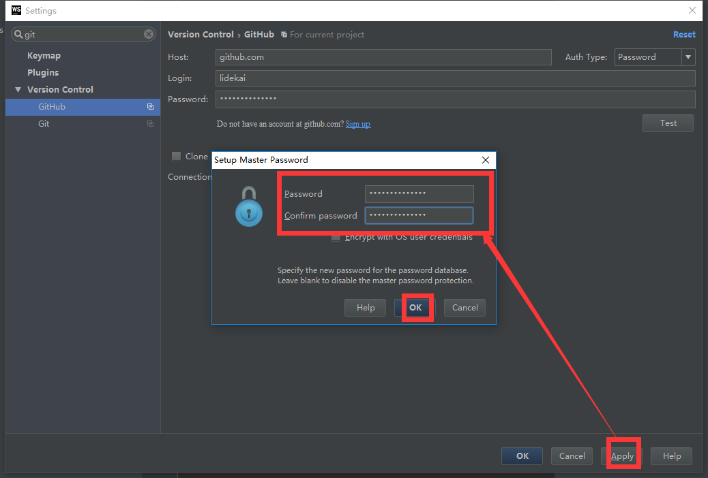
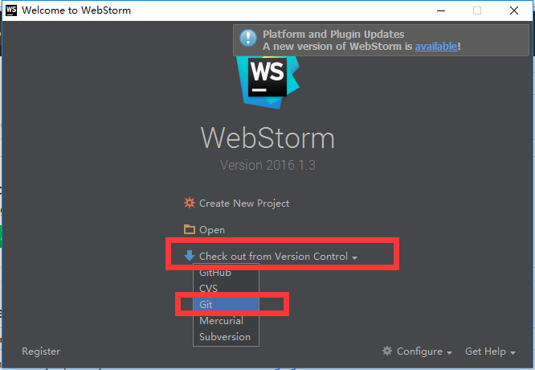
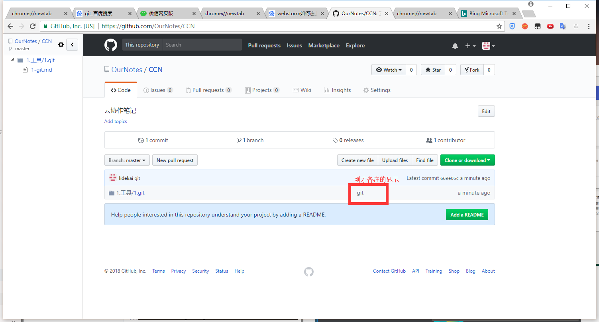
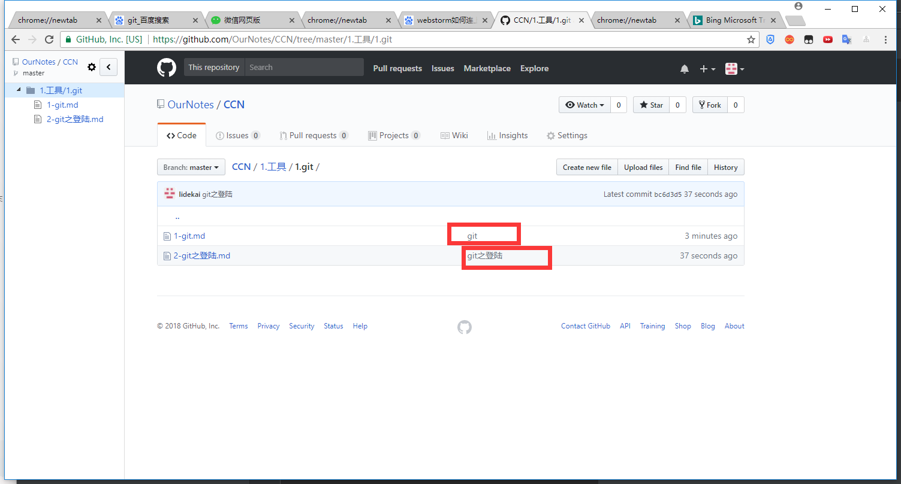

总操作流程：
- 1、谷歌浏览器安装插件；
- 2、开发软件安装markdown插件；
- 3、github创建团队开发项目；
- 4、配置git，github；
- 6、下拉，上传项目；
- 7、看效果；

----------

# 谷歌浏览器安装插件
[插件下载](https://pan.baidu.com/s/1D5XPzfVFZL3HBKYYbDku0g)

# 开发软件安装markdown插件（WebStorm做例子）
[WebStorm下载破解和安装markdown插件教程](https://github.com/OurNotes/CCN/blob/master/2.%E5%89%8D%E7%AB%AF/1.%E5%BC%80%E5%8F%91%E5%B7%A5%E5%85%B7/1-WebStorm%E7%9A%84%E4%B8%8B%E8%BD%BD%E5%AE%89%E8%A3%85.md)

`重启软件`
# github创建团队开发项目
[github之创建团队开发项目](https://github.com/OurNotes/CCN/blob/master/1.%E5%B7%A5%E5%85%B7/3.github/1-github%E4%B9%8B%E5%88%9B%E5%BB%BA%E5%9B%A2%E9%98%9F%E5%BC%80%E5%8F%91%E9%A1%B9%E7%9B%AE.md)
# 配置git，github

### 1、git
下载安装[git](https://git-scm.com/download/win)

### 2、github

# 下拉，上传项目
### 1、下拉

### 2、上传代码

# 看效果
`刷新github`

再次上传第二个

