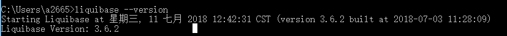

总操作流程：
- 1、[下载安装](#liquibase-01)
- 2、[配置](#liquibase-02)
    - 2.[1、配置环境变量](#liquibase-02-01)
    - 2.[2、添加包](#liquibase-02-02)
- 3、[测试](#liquibase-03)

***

# <a name="liquibase-01" href="#" >下载安装</a>

[](https://pan.baidu.com/s/1P30gA3QW7tCZgRuDkjnO1Q)

# <a name="liquibase-02" href="#" >配置</a>
### <a name="liquibase-02-01" href="#" >1、配置环境变量</a>
新建：
```
变量名：LIQUIBASE_HOME
变量值：安装的路径
```

path后添加：
```
;%LIQUIBASE_HOME%
```
### <a name="liquibase-02-02" href="#" >2、添加包</a>
在liquibase的lib文件夹下添加slf4j-api-xxxx.jar包

# <a name="liquibase-03" href="#" >测试</a>
```
liquibase --version
```

