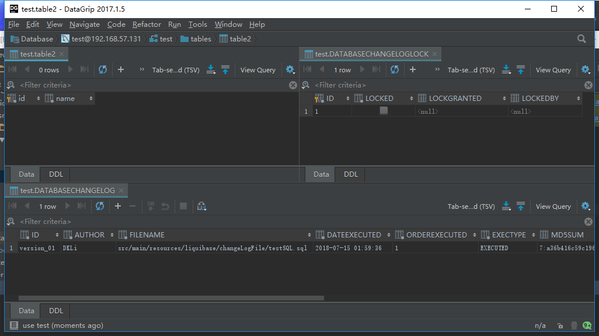

[](http://www.liquibase.org/documentation/sql_format.html)


总操作流程：
- 1、创建文件夹，修改文件和文件;
- 2、测试看效果;

***

# 创建文件夹，修改文件和文件
- 项目结构


### 1、创建文件夹
- resources
    - liquibase
        - changeLogFile
### 2、修改文件
- jdbc.properties


```
# 执行文件路径
changeLogFile=src/main/resources/liquibase/changeLogFile/testSQL.sql
```
### 3、创建文件
- testSQL.sql
```
--liquibase formatted sql

--changeset DKLi:version_01
CREATE TABLE table2 (
  id int(11) NOT NULL,
  name varchar(255) NOT NULL,
  PRIMARY KEY (id)
) ENGINE=MyISAM;
```
# 测试看效果
- 命令：
```
mvn liquibase:update
```
- 效果:
