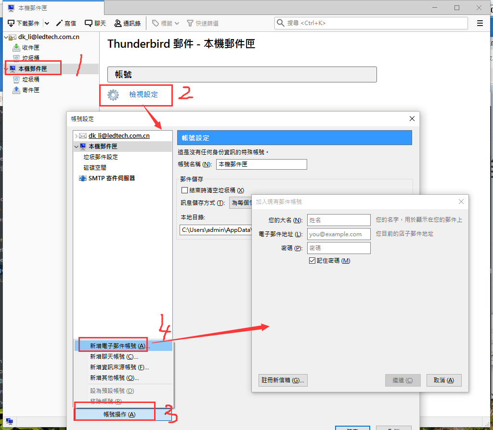
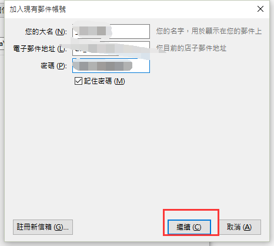
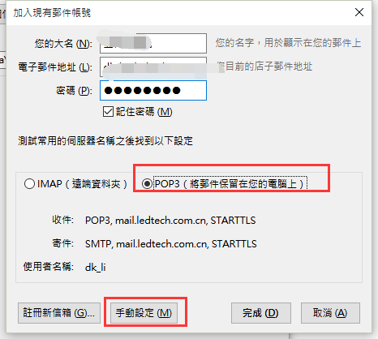
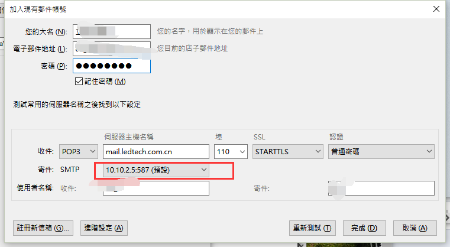
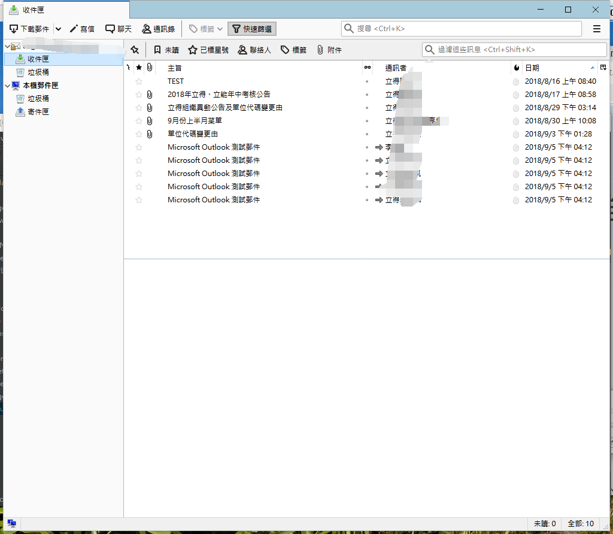

操作流程：
- 1、[下載安裝](#Thunderbird-01)
- 2、[登錄](#Thunderbird-02)
- 3、[看效果](#Thunderbird-03)

***

# <a name="Thunderbird-01" href="#" >下載安裝</a>

# <a name="Thunderbird-02" href="#" >登錄</a>

# <a name="Thunderbird-03" href="#" >看效果</a>

