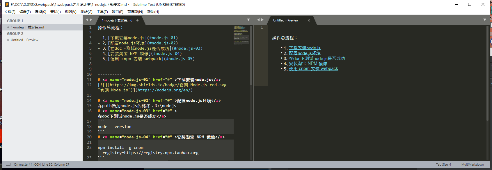
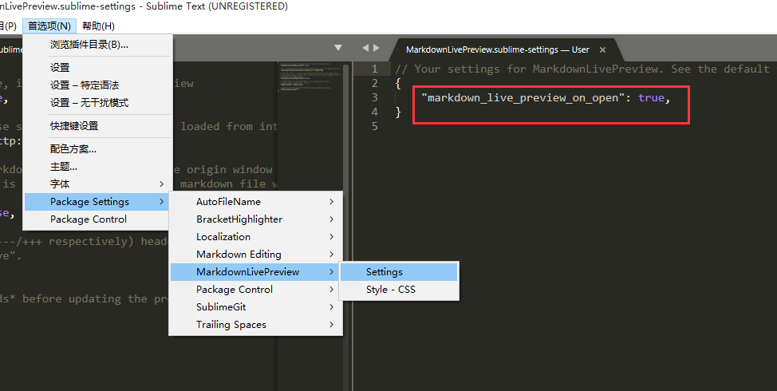
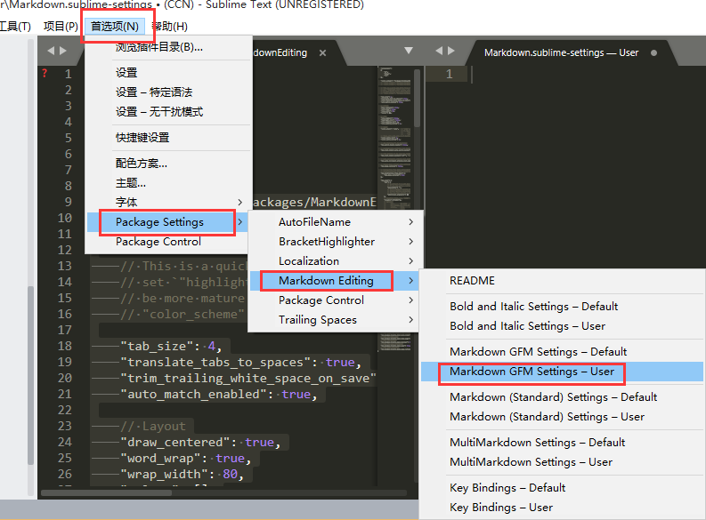
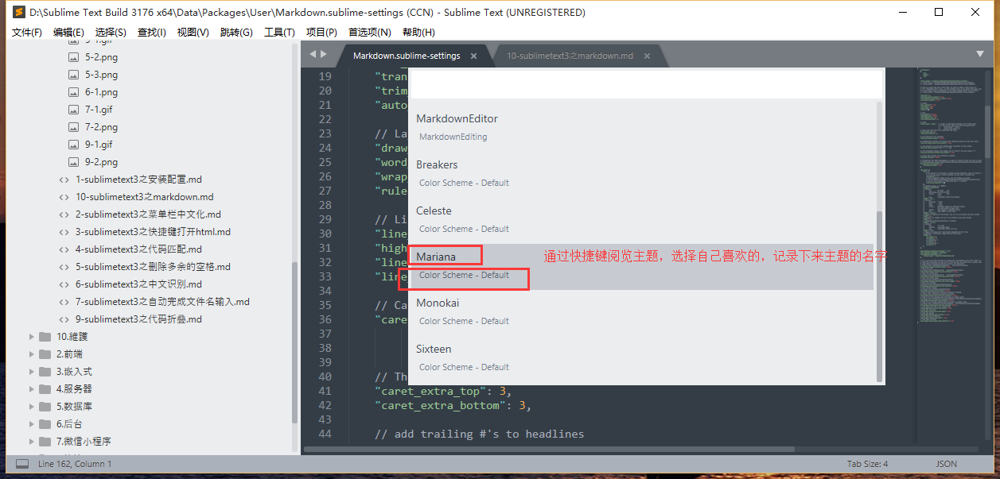

[](https://blog.csdn.net/galoa/article/details/79029758)

# 效果



# 操作

### 1、安裝插件
`
MarkdownEditing
`



### 2、配置

- 1、复制文件

`这里的配置内容复制一份`


`粘贴到这里`



- 2、选主题




- 3、修改配置


```
    // Layout
    "draw_centered": false,  //决定两侧是否留白，默认为true，修改为false去除左侧空白
    "word_wrap": true,
    "wrap_width": 120, //决定每行最大字数，这里设定为120
    "rulers": [],


    // Line
    "line_numbers": true, //显示行号，默认为false
    "highlight_line": false,
    "line_padding_top": 2,
    "line_padding_bottom": 2,
```

