总操作流程：
- 1、[初始化项目](#SublimeGit-01)
- 2、[添加项目到索引](#SublimeGit-02)
    - 2.[1、将不提交的文件进行忽视](#SublimeGit-02-01)
    - 2.[2、添加代码到索引](#SublimeGit-02-02)
- 3、[提交代码](#SublimeGit-03)
    - 3.[1、写提交备注](#SublimeGit-03-01)
    - 3.[2、连接远程库](#SublimeGit-03-02)
    - 3.[3、推送代码](#SublimeGit-03-03)
- 4、[看效果](#SublimeGit-04)

***

# <a name="SublimeGit-01" href="#" >初始化项目,/a>

`按快捷键：Ctrl+Shift+P,输入：gi`

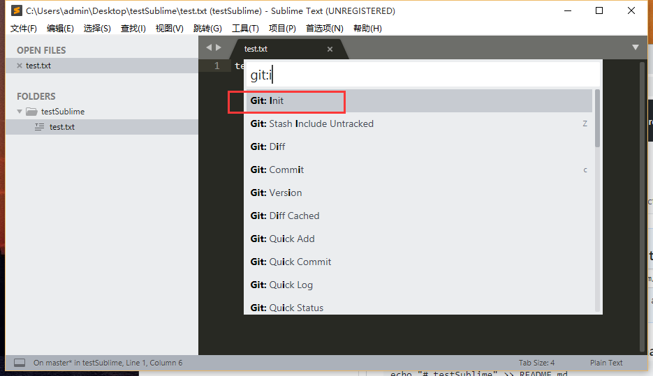

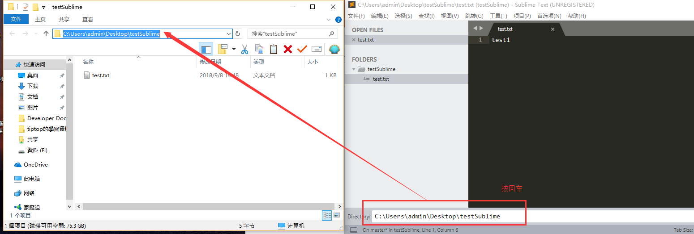

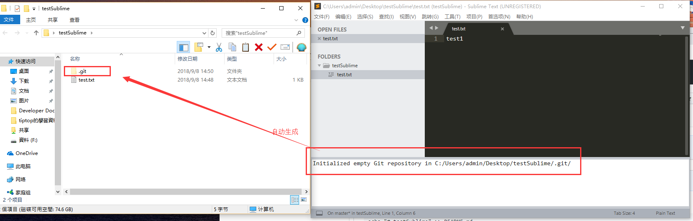

# <a name="SublimeGit-02" href="#" >添加项目到索引</a>

`按快捷键：Ctrl+Shift+P,输入：gs`

### <a name="SublimeGit-02-01" href="#" >1、将不提交的文件进行忽视</a>

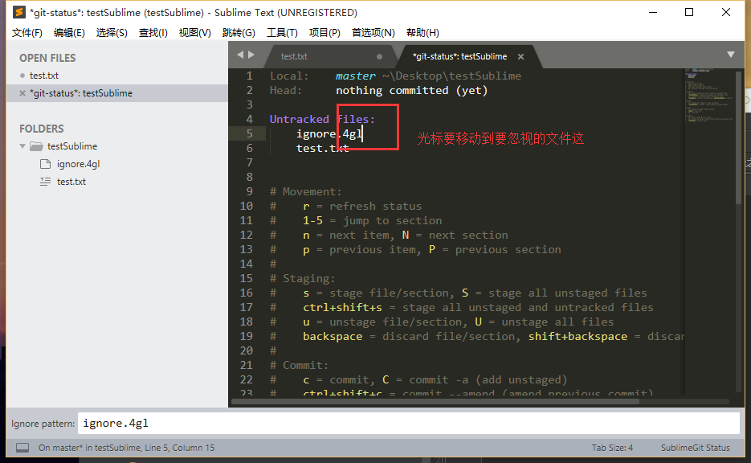

`按快捷键：I  大写的`

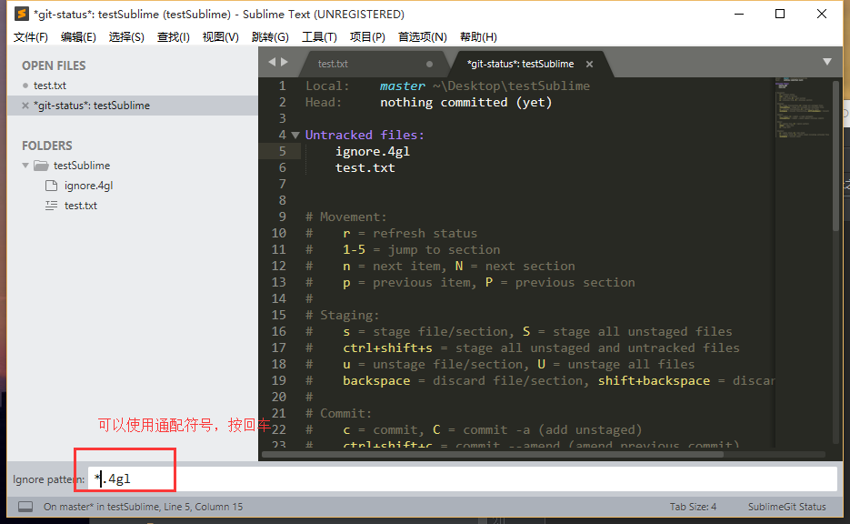

### <a name="SublimeGit-02-02" href="#" >2、添加代码到索引</a>

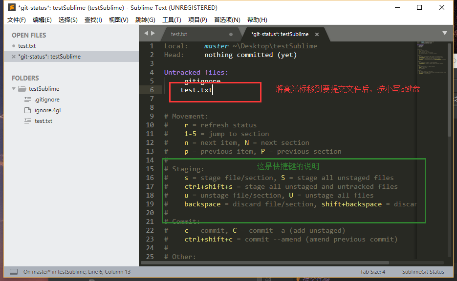

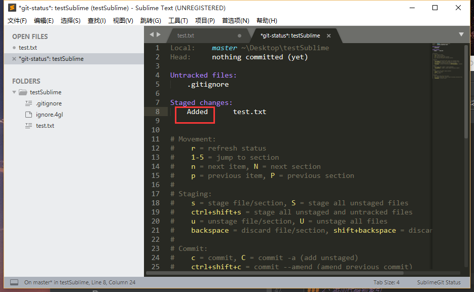

# <a name="SublimeGit-03" href="#" >提交代码</a>

`按快捷键：c  进入commit写备注界面
`
### <a name="SublimeGit-03-01" href="#" >1、写提交备注</a>

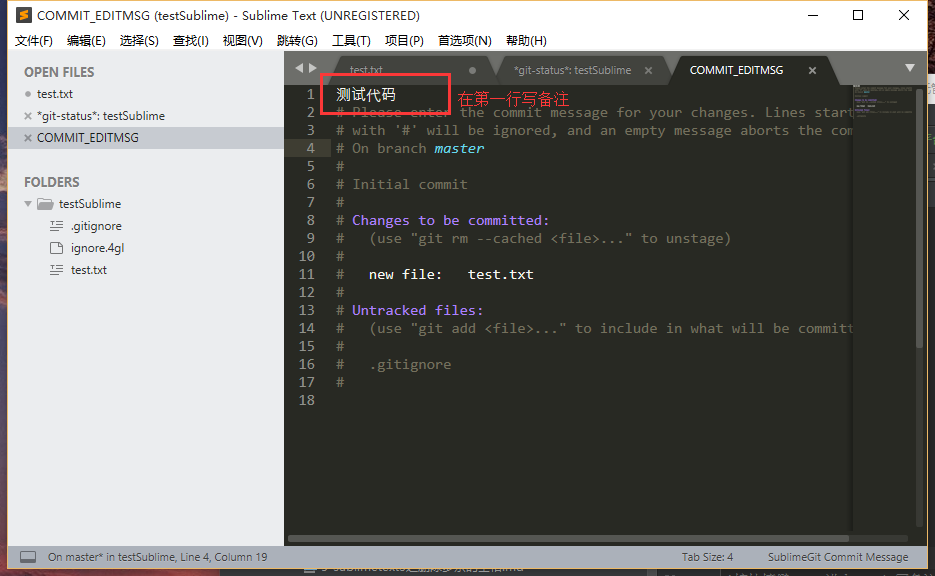

`写完后关掉窗口`

### <a name="SublimeGit-03-02" href="#" >2、连接远程库</a>

`按快捷键：Ctrl+Shift+P,输入：gar`

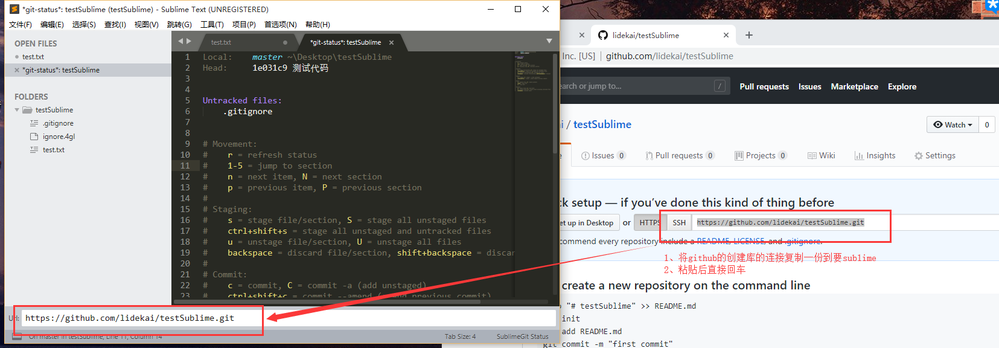

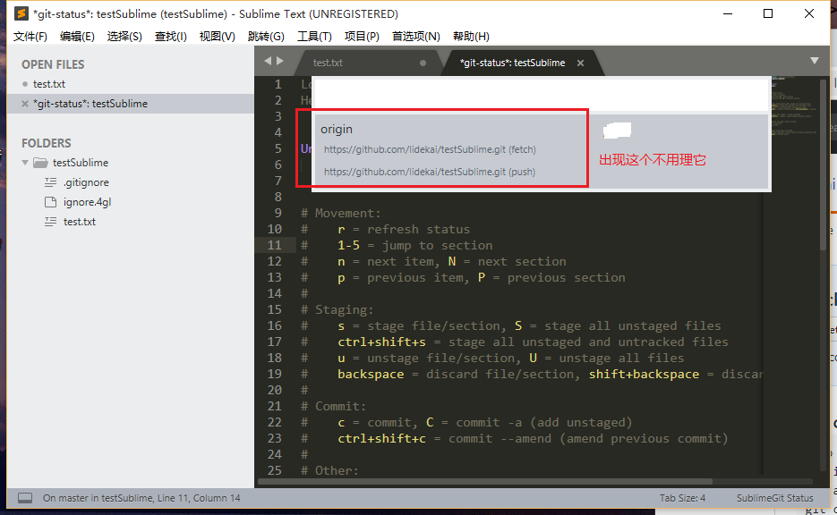

### <a name="SublimeGit-03-03" href="#" >3、推送代码</a>

`按快捷键：Ctrl+Shift+P,输入：gpcb`

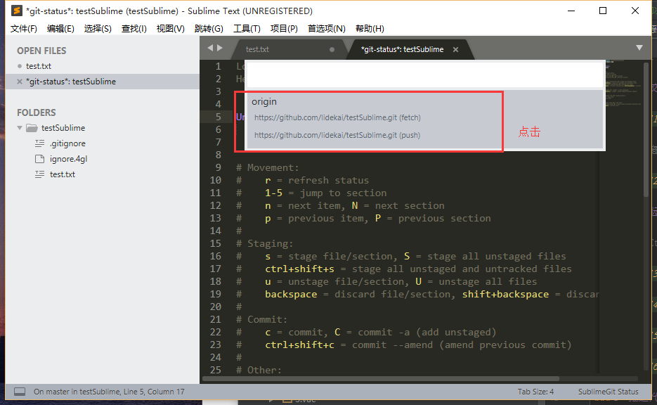

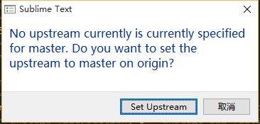

# <a name="SublimeGit-04" href="#" >看效果</a>

