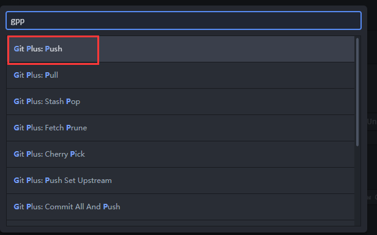
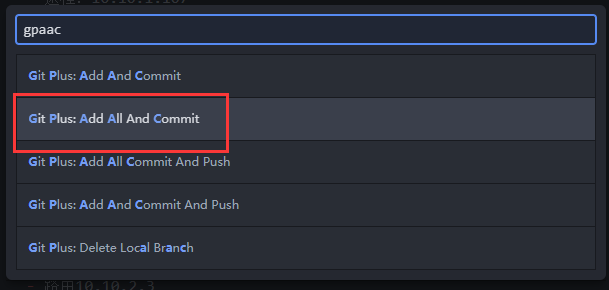

本页目录：
- 1、[安装插件](#atom-01)
- 2、[下拉项目](#atom-02)
- 3、[提交项目](#atom-03)

***

# <a name="atom-01" href="#" >安装插件</a>

> 安装插件：git-plus

# <a name="atom-02" href="#" >下拉项目</a>

`按快捷键：Ctrl+Shift+P，输入gpp`

# <a name="atom-03" href="#" >提交项目</a>

`按快捷键：Ctrl+Shift+P，输入gpaacp`

