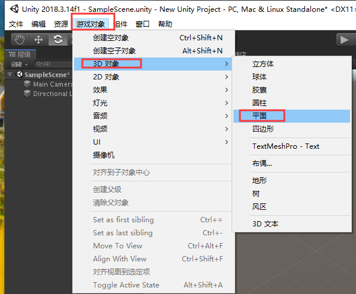
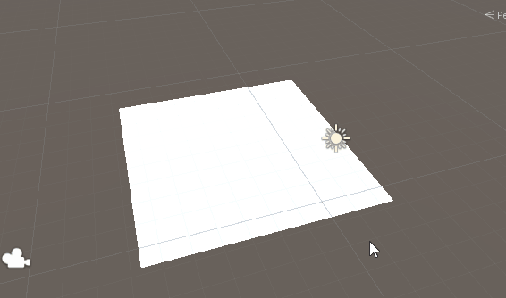
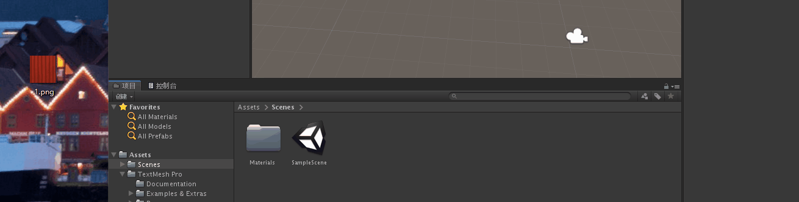
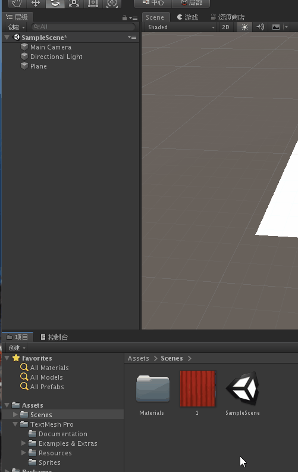

总操作流程：
- 1、[创建平面](#unity-01)
- 2、[导入图片](#unity-02)
- 3、[上色](#unity-03)

***

# <a name="unity-01" href="#" >创建平面</a>

> 1、创建一个3D项目

> 2、创建平面

- 快捷键旋转视角查看：Alt+鼠标左键（一直按着不放）+鼠标移动

# <a name="unity-02" href="#" >导入图片</a>

> 将图片直接拖进来

# <a name="unity-03" href="#" >上色</a>

> 将图片直接拖到平面处

