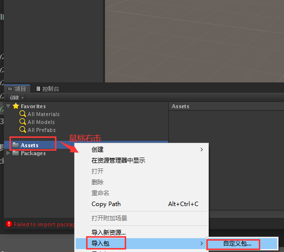
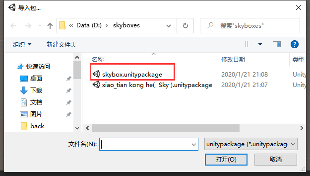
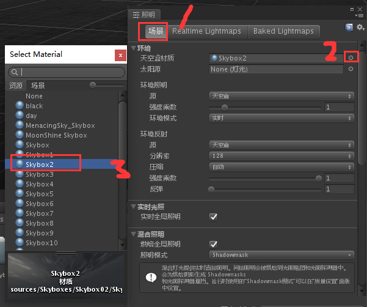

总操作流程：
- 1、[下载资源](#unity-01)
- 2、[导入资源](#unity-02)
- 3、[看效果](#unity-03)

***

# <a name="unity-01" href="#" >下载资源</a>

# <a name="unity-02" href="#" >导入资源</a>

- 导入

- 配置

# <a name="unity-03" href="#" >看效果</a>

> 按一下Alt+一直按鼠标左键+移动鼠标，可以切换角度

