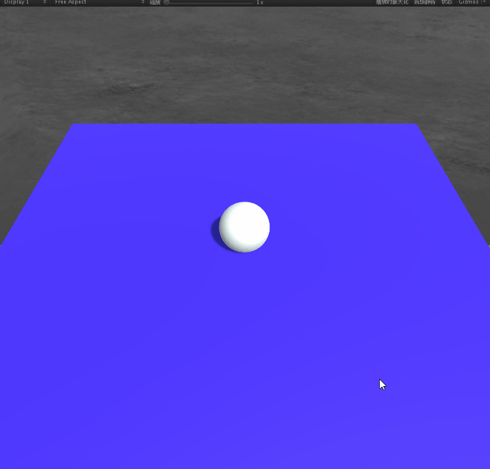
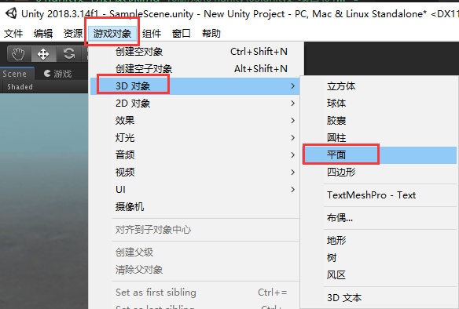
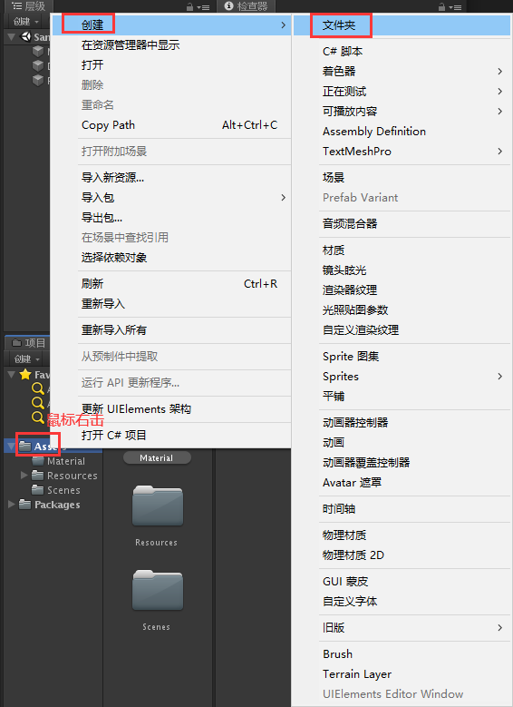
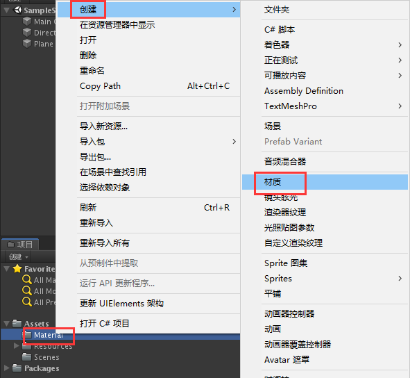
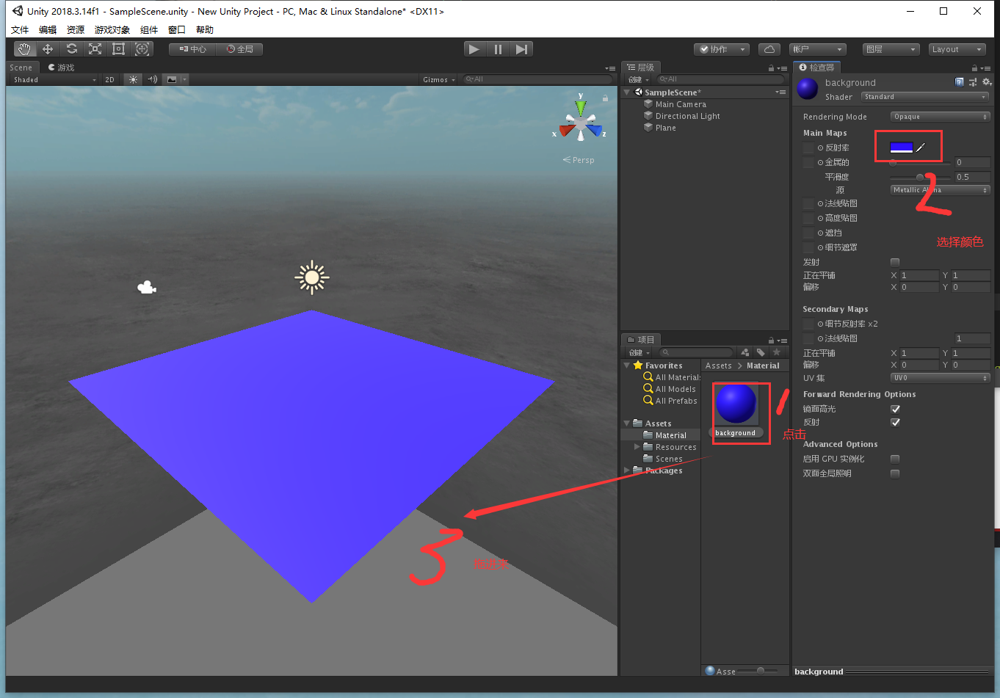
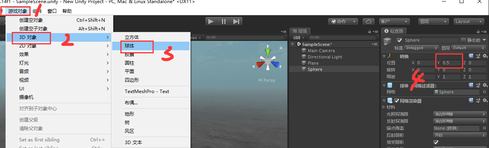
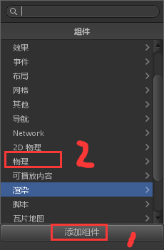
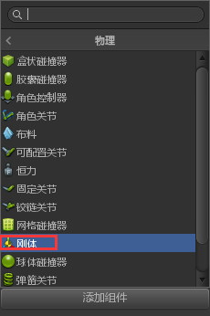
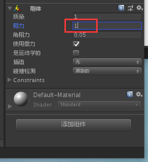

总操作流程：、
- 1、看效果
- 2、创建Plane
- 3、创建滚球
- 4、写代码


*** 

# 看效果

> 按键盘的上下左右方向键，测试看效果。



# 创建Plane

> 创建plane。命名Ground



> 给plane上色

- 创建Material文件夹



- 创建Material元素,命名为background，选择颜色为深色





# 创建球体

> 创建球体。命名Player



> 添加刚体组件







# 写代码

> 创建Scripts文件夹,并且在其文件夹下创建c#脚本，命名：PlayerController

```java
using System.Collections;
using System.Collections.Generic;
using UnityEngine;

public class PlayerController : MonoBehaviour {

    public float speed;

    private Rigidbody rb;

    void Start ()
    {
        rb = GetComponent<Rigidbody>();
    }

    void FixedUpdate ()
    {
        float moveHorizontal = Input.GetAxis ("Horizontal");
        float moveVertical = Input.GetAxis ("Vertical");

        Vector3 movement = new Vector3 (moveHorizontal, 0.0f, moveVertical);

        rb.AddForce (movement * speed);
    }
}
```

> 写好代码后，拖进球体，并运行项目

