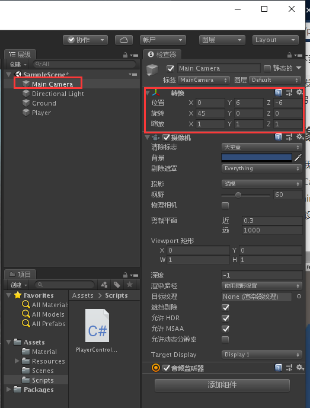
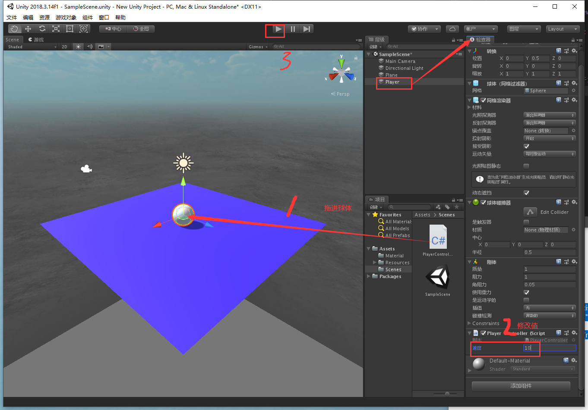

总操作流程：、
- 1、[看效果](#unity-01)
- 2、[创建Plane](#unity-02)
- 3、[创建滚球](#unity-03)
- 4、[写代码](#unity-04)


*** 

# <a name="unity-01" href="#" >看效果</a>

> 按键盘的上下左右方向键，测试看效果。


# <a name="unity-02" href="#" >创建Plane</a>

> 创建plane。命名Ground


> 给plane上色

- 创建Material文件夹


- 创建Material元素,命名为background，选择颜色为深色


# <a name="unity-03" href="#" >创建球体</a>

> 创建球体。命名Player


> 添加刚体组件


# <a name="unity-04" href="#" >写代码</a>

> 创建Scripts文件夹,并且在其文件夹下创建c#脚本，命名：PlayerController

```java
using System.Collections;
using System.Collections.Generic;
using UnityEngine;

public class PlayerController : MonoBehaviour {

    public float speed;

    private Rigidbody rb;

    void Start ()
    {
        rb = GetComponent<Rigidbody>();
    }

    void FixedUpdate ()
    {
        float moveHorizontal = Input.GetAxis ("Horizontal");
        float moveVertical = Input.GetAxis ("Vertical");

        Vector3 movement = new Vector3 (moveHorizontal, 0.0f, moveVertical);

        rb.AddForce (movement * speed);
    }
}
```

> 设置摄像机角度



> 将PlayerController文件拖进球体，并运行项目

