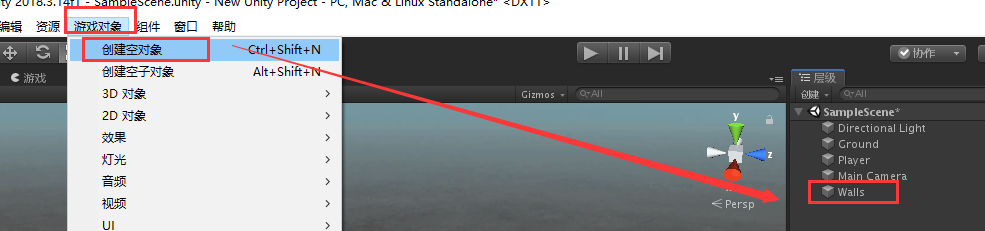

总操作流程：
- 1、创建对象
- 2、设置
- 3、看效果

***

# 创建对象

> 创建空对象

- 创建空对象，并且命名：Walls

> 创建立方体

- 在Walls下创建4个立方体，并且分别命名为：East Wall、South Wall、North Wall、West Wall

# 设置

> East Wall

> South Wall

> North Wall

> West Wall

# 看效果

