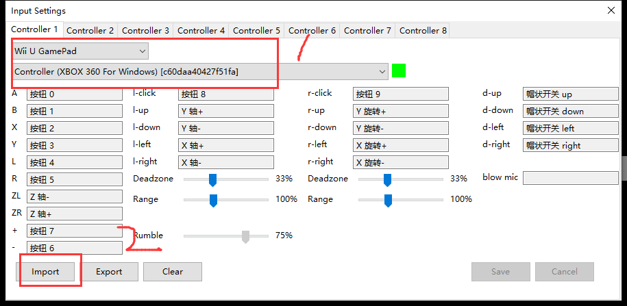

总操作流程：
- 1、下载安装
- 2、配置
- 3、测试

***

# 下载安装

> 1、下载

- 本体软件

- 手机控制平衡感软件

- cemu模拟器（使用这个代替原来的）

# 配置

> NVIDIA设置

> cemu 360手柄按键设置

# 测试

> cemu 加载游戏

- 菜单选项选择：file > lode

- 游戏加载：E:\Zelda\rar\Zelda\game\code\U-King.rpx
