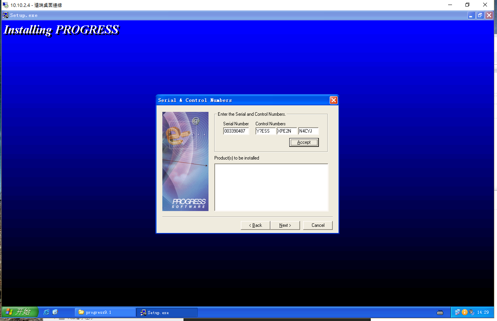
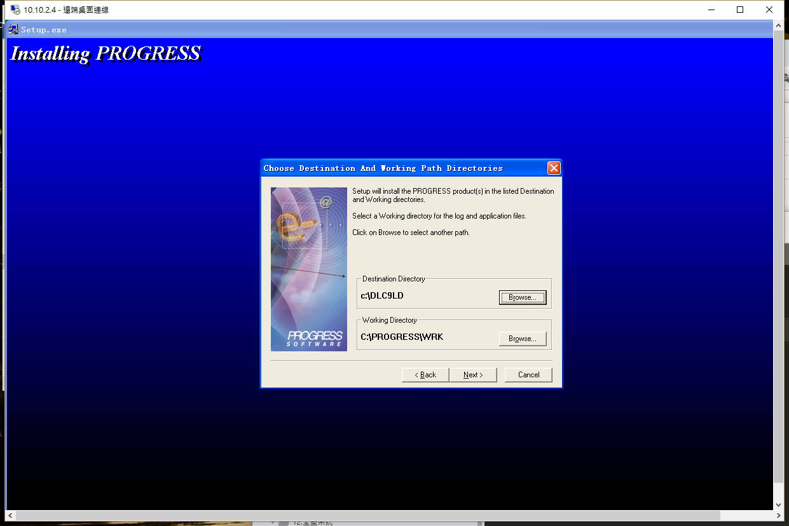
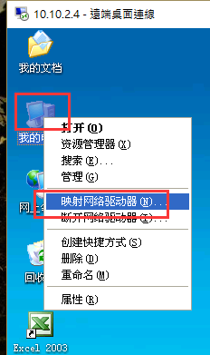
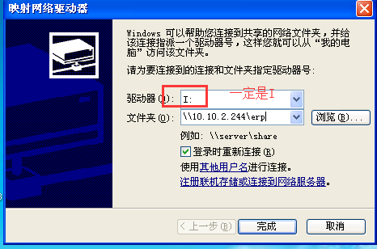

`注意：本系统只能适用于32位`

总操作流程：
- 1、下载安装
- 2、配置
- 3、测试

***

# 下载安装

- 下载

[](https://pan.baidu.com/s/17sbjJKWXYW4bHNEEvl98rw)

- 安装

```
serial : 003390487
id control : Y?ESS-XPE2N-N4CYJ
```



安装目录一定是：c:\dlc91d



`安装后重启电脑`

# 配置

- 复制文件

```

进入：\\10.10.2.244\erp，复制hosts和services文件

用户名：YES  密码：123

```

- 移动文件

```
将复制文件粘贴到C:\WINDOWS\system32\drivers\etc下
```

- 设置映射文件路径





# 测试

登陆:寶盛系統(立得)800


```
用户名：admin
密码：frankliou
```
