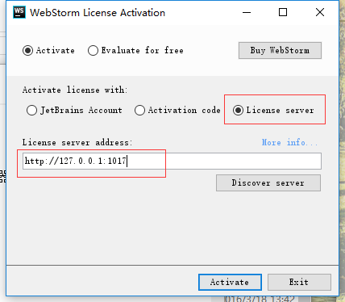

总操作流程：
1、下载
2、安装配置破解
3、添加插件

----------
- 下载
```
https://www.jetbrains.com/webstorm/download/previous.html
```

- 安装配置破解

```
http://idea.iteblog.com/key.php
```
- 添加插件
```
File -> settings -> Plugins 即可调出设置中的插件选项。
```
参考：
https://www.zhihu.com/question/22437385

