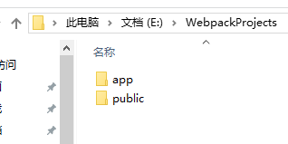

总操作流程：
- 1、[创建三个文件夹](#webpack-01)
- 2、[初始化](#webpack-02)
- 3、[创建四个文件](#webpack-03)
    - 3.[1、index.html代码](#webpack-03-01)
    - 3.[2、Greeter.js代码](#webpack-03-02)
    - 3.[3、main.js代码](#webpack-03-03)
    - 3.[4、webpack.config.js代码](#webpack-03-04)
- 4、[打包](#webpack-04)
- 5、[测试](#webpack-05)

[](https://github.com/lidekai/WebpackProjects-SimpleHtml.git)

----------

- 代码结构


# <a name="webpack-01" href="#" >创建三个文件夹</a>
1、WebpackProjects

2、app

3、public



# <a name="webpack-02" href="#" >初始化(cmd进入文件夹初始化)</a>
```
cnpm init
```
# <a name="webpack-03" href="#" >创建三个文件</a>
```
index.html --放在public文件夹中;
Greeter.js-- 放在app文件夹中;
main.js-- 放在app文件夹中;
webpack.config.js--放在根目录文件夹中
```
### <a name="webpack-03-01" href="#" >1、index.html代码</a>
```
<!-- index.html -->
<!DOCTYPE html>
<html lang="en">
  <head>
    <meta charset="utf-8">
    <title>Webpack Sample Project</title>
  </head>
  <body>
  	<script type="text/javascript" src="public/bundle.js" charset="utf-8"></script>
    <div id='root'>
    </div>
  </body>
</html>
```
### <a name="webpack-03-02" href="#" >2、Greeter.js代码</a>
```
// Greeter.js
module.exports = "It works from Greeter.js.";
```
### <a name="webpack-03-03" href="#" >3、main.js代码</a>
```
//main.js
document.write(require("./Greeter.js"));
```
### <a name="webpack-03-04" href="#" >4、webpack.config.js代码</a>
```
module.exports = {
  entry:  __dirname + "/app/main.js",//已多次提及的唯一入口文件
  output: {
    path: __dirname + "/public",//打包后的文件存放的地方
    filename: "bundle.js"//打包后输出文件的文件名
  }
}
```
# <a name="webpack-04" href="#" >打包</a>
```
webpack
```
# <a name="webpack-05" href="#" >测试</a>
点击打开html文件