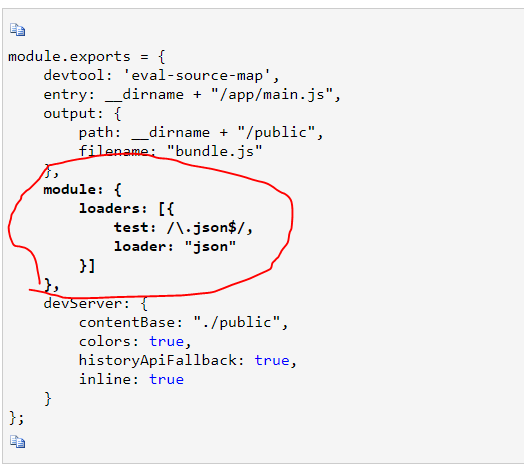

总操作流程：
- 1、[下载安装Loaders](#webpack-01)
- 2、[在app文件夹创建config.json文件](#webpack-02)
- 3、[修改Greeter.js文件](#webpack-03)
- 4、[修改main.js文件](#webpack-04)

[](https://github.com/lidekai/WebpackProjects-Loaders-json.git)

----------


# <a name="webpack-01" href="#" >下载安装Loaders</a>
```
cnpm install -g --save-dev json-loader
```
# <a name="webpack-02" href="#" >在app文件夹创建config.json文件</a>
```
{
    "greetText": "Hi there and greetings from Json!"
}
```

# <a name="webpack-03" href="#" >修改Greeter.js文件</a>
```
// Greeter.js
var config = require('./config.json');

module.exports = function() {
  var a = config.greetText;
  return a;
};
```

# <a name="webpack-04" href="#" >修改main.js文件</a>
```
//main.js
const greeter = require('./Greeter.js');
document.write(greeter());
```

`
注：件由于webpack3.*/webpack2.*已经内置可处理JSON文件，这里我们无需再添加webpack1.*需要的json-loader。
`

不需要加

