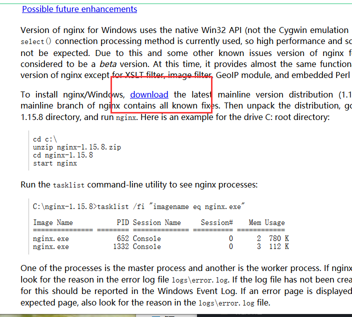
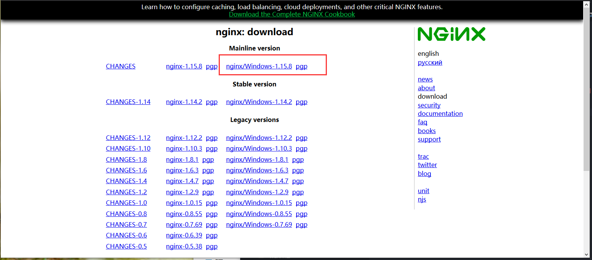
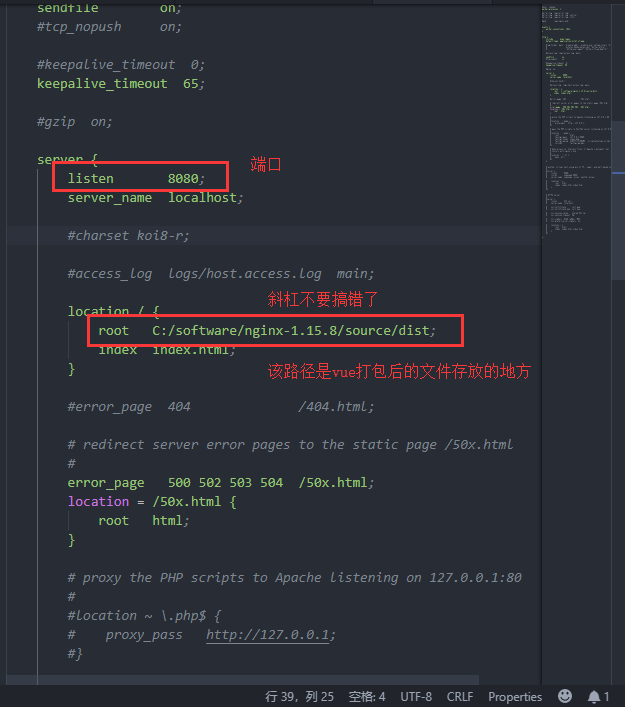

总操作流程：
- 1、[下载解压配置nginx](#vue.js-01)
- 2、[vue项目打包部署](#vue.js-02)
- 3、[看效果](#vue.js-03)

***

# <a name="vue.js-01" href="#" >下载解压配置nginx</a>

> 1、下载

[](http://nginx.org/en/docs/windows.html)





# <a name="vue.js-02" href="#" >解压配置</a>

>nginx-1.15.8\conf\nginx.conf



# <a name="vue.js-03" href="#" >vue项目打包部署</a>

[](https://github.com/OurNotes/CCN/blob/master/2.%E5%89%8D%E7%AB%AF/3.vue/2.vue.js%E4%B9%8B%E5%AD%A6%E4%B9%A0/2-vue.js%E4%B9%8B%E6%89%93%E5%8C%85.md)

# <a name="vue.js-04" href="#" >看效果</a>

> cmd进入nginx目录运行命令
```
start nginx #启动
```

浏览器进入配置好的IP和端口


> 其他命令
```
nginx -s quit #停止命令
nginx -s reload #重启命令
```