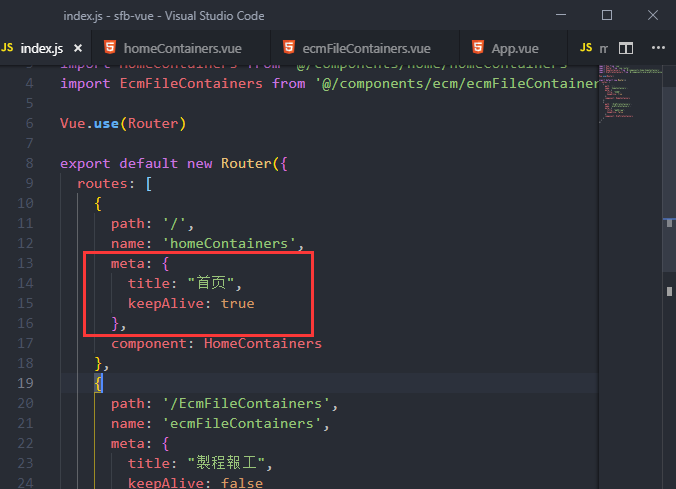

总操作流程：
- 1、安装
- 2、修改代码
- 3、看效果

*** 

# 安装

```
cnpm install vue-wechat-title --save
```

# 修改代码

>1、main.js
```js
import VueWechatTitle from 'vue-wechat-title'

Vue.use(VueWechatTitle)
```

>2、路由js

```js
meta: { 
        title: "首页",
        keepAlive: true 
      },
```



> 3、App.vue
```js
<router-view v-wechat-title='$route.meta.title'/>
```

# 看效果

运行看效果