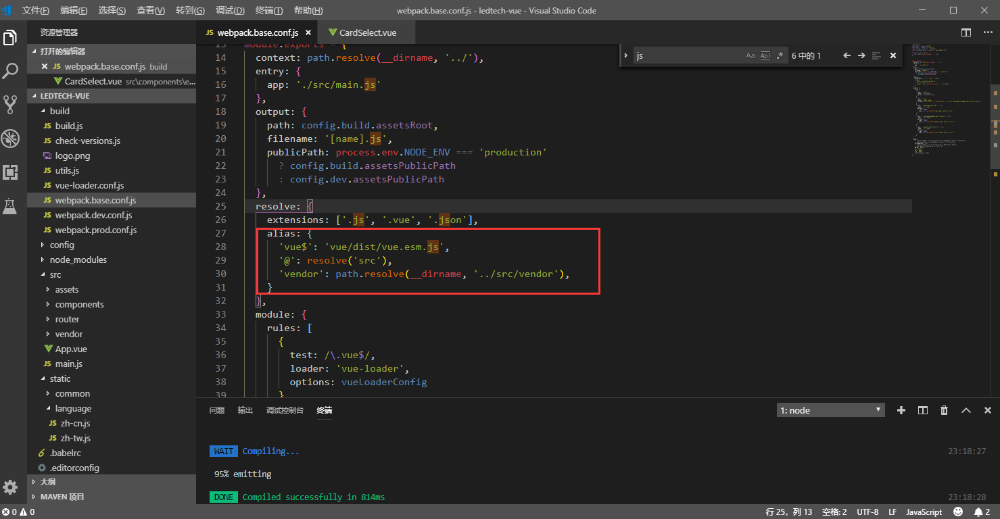

总操作流程：
 
 方法一:
- 1、[下载安装](#vue.js-01)
- 2、[写代码](#vue.js-02)
- 3、[测试](#vue.js-03)

 方法二:
- 1、[下载安装](#vue.js-04)
- 2、[写代码](#vue.js-05)
- 3、[测试](#vue.js-06)

***

- 方法一（这种方式导出的字符串是数据的话，会自动转数字，会将最前面的0清除，并且将%的数据自动转小数）

# <a name="vue.js-01" href="#" >下载安装</a>

```js
cnpm install --save xlsx 
cnpm install --save file-saver 
```

# <a name="vue.js-02" href="#" >写代码</a>

>1、在有要导出table的组件中引用

```js
import XLSX from 'xlsx';
import FileSaver from 'file-saver'
```

>2、table的元素加id
```js
id="PSTableData"
```

>3、写方法
```js
exportExcel(val) { //导出Excel
        let wb=XLSX.utils.table_to_book(document.getElementById('PSTableData'));
        let wbout=XLSX.write(wb,{bookType:'xlsx',type:'binary'});
        FileSaver.saveAs(new Blob([this.s2ab(wbout)],{type:'application/octet-stream'}),"ProductionSchedule.xlsx");
      },
      s2ab:function(s){
        if(typeof ArrayBuffer !=='undefined'){
          let buf=new ArrayBuffer(s.length);
          let view=new Uint8Array(buf);
          for(var i=0;i!=s.length;++i){
            view[i]=s.charCodeAt(i) & 0xFF;
          }
          return buf;
        }else{
          let buf=new Array(s.length);
          for(var i=0; i!=s.length;++i){
            buf[i]=s.charCodeAt(i) & 0xFF;
            return buf;
          }
        }
      }
```

# <a name="vue.js-03" href="#" >测试</a>

运行测试

- 方法二

# <a name="vue.js-04" href="#" >下载安装</a>

```js
cnpm install --save xlsx 
cnpm install --save file-saver 
cnpm install --save script-loader
```

# <a name="vue.js-05" href="#" >写代码</a>

>1、在有要导出table的组件中引用

```js
import XLSX from 'xlsx';
import FileSaver from 'file-saver'
```

>2、引用js，整个文件夹放到src下
[](https://pan.baidu.com/s/151Gnqi7mRl6qlwUWxYZtVg)

密钥：j41u

>3、修改build\webpack.base.conf.js配置文件



```
'vendor': path.resolve(__dirname, '../src/vendor'),
```

> 4、写方法

```js
  formatJson(filterVal, jsonData) {
        return jsonData.map(v => filterVal.map(j => v[j]))
      },
      export2Excel() {
        require.ensure([], () => {
          const {
            export_json_to_excel
          } = require('../../../src/vendor/Export2Excel');
          const tHeader = ['卡号', '名字', '打卡时间', '打卡方式', '打卡机名称'];//导出数据源的头名称
          const filterVal = ['esID', 'esName', 'asTime', 'asType', 'asName', ];//json数据源的key
          const list = this.tableAM;//json数据源
          const data = this.formatJson(filterVal, list);
          export_json_to_excel(tHeader, data, '多打卡的');//导出文件名称
        })
      },
```

> 4、引用

```js
this.export2Excel()
```

# <a name="vue.js-06" href="#" >测试</a>

运行测试