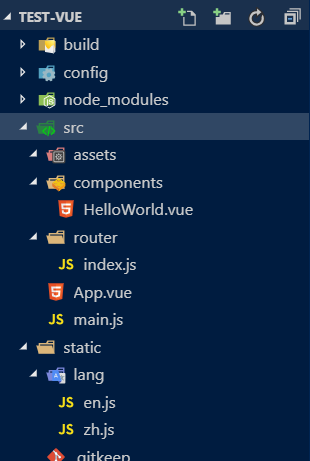
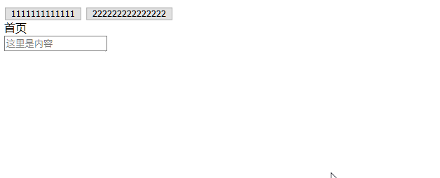

总操作流程：
- 1、[安装插件](#vue.js-01)
- 2、[写代码](#vue.js-02)
- 3、[测试](#vue.js-03)

***

# <a name="vue.js-01" href="#" >安装插件</a>
```
cnpm install vue-i18n --save-dev
```

# <a name="vue.js-02" href="#" >写代码</a>

>目录结构



>写语言js

- zh.js

```js
module.exports = {
  menu : {
     home:"首页"
  },
  content:{
     main:"这里是内容"
 }
```

- en.js

```js
module.exports = {
  menu : {
     home:"home"
  },
  content:{
     main:"this is content"
 }
}
```

>main.js引用

```js
import VueI18n from 'vue-i18n'
Vue.use(VueI18n)
const i18n = new VueI18n({
  locale: 'zh', 
  messages: {
    'zh': require('../static/lang/zh'),
    'en': require('../static/lang/en')
  }
})
Vue.config.productionTip = false

new Vue({
  el: '#app',
  router,
  i18n,
  components: { App },
  template: '<App/>'
})

```

>写程序

- html

```html
<div class="hello">
    <button @click="tabEn">1111111111111</button>
    <button @click="tabCn">222222222222222</button>
    <div class="title">{{$t('menu.home')}}</div>
    <input :placeholder="$t('content.main')" type="text">
  </div>
```

- 方法

```js
methods: {
      tabEn: function () {
        this.$i18n.locale = 'en';
      },
      tabCn: function () {
        this.$i18n.locale = 'zh';
      }
    }
```


# <a name="vue.js-03" href="#" >测试</a>

