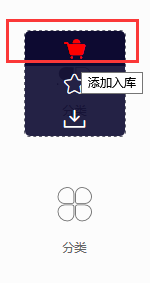
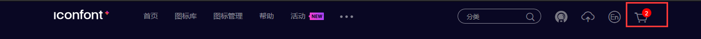
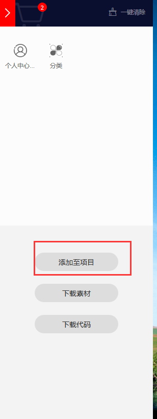
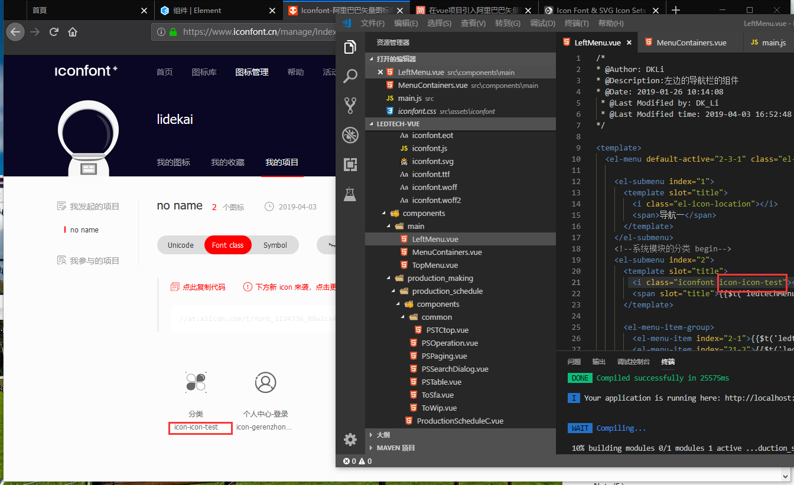
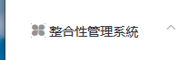

总操作流程:
- 1、下载图标包
- 2、写代码
- 3、看效果

***

# 下载图标包

[](https://www.iconfont.cn/manage/index?manage_type=myprojects&projectId=1124336)








# 写代码

> 1、导入文件

- 将下载好的文件放到：assets\iconfont下

- 在main.js引用：import './assets/iconfont/iconfont.css'


> 2、写代码

```
 <i class="iconfont icon-icon-test"></i>
```



# 看效果

