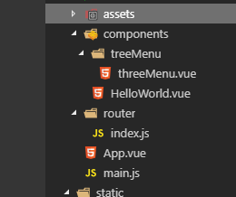

总操作流程;
- 1、写代码
- 2、测试

***

- 项目目录结构



# 写代码

> 1、sql server的sql

```sql

IF EXISTS (SELECT * FROM sys.all_objects WHERE object_id = OBJECT_ID(N'[dbo].[MENU]') AND type IN ('U'))
	DROP TABLE [dbo].[MENU]
GO

CREATE TABLE [dbo].[MENU] (
  [menuID] varchar(100) COLLATE Chinese_PRC_CI_AS  NOT NULL,
  [menuParent] varchar(100) COLLATE Chinese_PRC_CI_AS  NULL,
  [menuName] varchar(255) COLLATE Chinese_PRC_CI_AS  NULL,
  [menuUrl] varchar(255) COLLATE Chinese_PRC_CI_AS  NULL,
  [menuIcon] varchar(100) COLLATE Chinese_PRC_CI_AS  NULL,
  [menuIs] int  NULL,
  [createTime] datetime  NULL,
  [updateTime] datetime  NULL,
  [lastLoginTime] datetime  NULL,
  [menuCode] nvarchar(100) COLLATE Chinese_PRC_CI_AS  NULL
)
GO

ALTER TABLE [dbo].[MENU] SET (LOCK_ESCALATION = TABLE)
GO

EXEC sp_addextendedproperty
'MS_Description', N'菜单主键',
'SCHEMA', N'dbo',
'TABLE', N'MENU',
'COLUMN', N'menuID'
GO

EXEC sp_addextendedproperty
'MS_Description', N'父节点',
'SCHEMA', N'dbo',
'TABLE', N'MENU',
'COLUMN', N'menuParent'
GO

EXEC sp_addextendedproperty
'MS_Description', N'菜单名',
'SCHEMA', N'dbo',
'TABLE', N'MENU',
'COLUMN', N'menuName'
GO

EXEC sp_addextendedproperty
'MS_Description', N'菜单地址',
'SCHEMA', N'dbo',
'TABLE', N'MENU',
'COLUMN', N'menuUrl'
GO

EXEC sp_addextendedproperty
'MS_Description', N'图标',
'SCHEMA', N'dbo',
'TABLE', N'MENU',
'COLUMN', N'menuIcon'
GO

EXEC sp_addextendedproperty
'MS_Description', N'是否菜单 1:菜单 0:模块',
'SCHEMA', N'dbo',
'TABLE', N'MENU',
'COLUMN', N'menuIs'
GO

EXEC sp_addextendedproperty
'MS_Description', N'创建时间',
'SCHEMA', N'dbo',
'TABLE', N'MENU',
'COLUMN', N'createTime'
GO

EXEC sp_addextendedproperty
'MS_Description', N'更新时间',
'SCHEMA', N'dbo',
'TABLE', N'MENU',
'COLUMN', N'updateTime'
GO

EXEC sp_addextendedproperty
'MS_Description', N'最后登录时间',
'SCHEMA', N'dbo',
'TABLE', N'MENU',
'COLUMN', N'lastLoginTime'
GO

EXEC sp_addextendedproperty
'MS_Description', N'模块代号',
'SCHEMA', N'dbo',
'TABLE', N'MENU',
'COLUMN', N'menuCode'
GO

INSERT INTO [dbo].[MENU]  VALUES (N'1', N'0', N'系统管理', NULL, N'iconfont icon-xitongshezhi', N'1', N'2019-04-17 11:07:36.000', N'2019-04-17 11:07:39.000', N'2019-04-17 11:07:42.000', N'')
GO

INSERT INTO [dbo].[MENU]  VALUES (N'2', N'1', N'用户管理', N'@/components/use/UserContainers', N'iconfont icon-yonghuguanli', N'0', N'2019-04-17 11:09:01.000', N'2019-04-17 11:09:03.000', N'2019-04-17 11:09:06.000', N'UserContainers')
GO

INSERT INTO [dbo].[MENU]  VALUES (N'3', N'1', N'权限管理', N'@/components/permissions/PermissionsContainers', N'iconfont icon-quanxianguanli', N'0', N'2019-04-17 11:11:00.000', N'2019-04-17 11:11:02.000', N'2019-04-17 11:11:04.000', N'PermissionsContainers')
GO

INSERT INTO [dbo].[MENU]  VALUES (N'4', N'1', N'菜单管理', N'@/components/menu/MenuContainers', N'iconfont icon-caidanguanli_', N'0', N'2019-04-17 11:12:33.000', N'2019-04-17 11:12:31.000', N'2019-04-17 11:12:28.000', N'MenuContainers')
GO

INSERT INTO [dbo].[MENU]  VALUES (N'5', N'0', N'整合性系统', NULL, N'iconfont icon-mokuaiguanli', N'1', N'2019-04-17 11:13:57.000', N'2019-04-17 11:14:00.000', N'2019-04-17 11:14:02.000', NULL)
GO

INSERT INTO [dbo].[MENU]  VALUES (N'6', N'5', N'生产制作管理', NULL, NULL, N'1', N'2019-04-17 11:15:00.000', N'2019-04-17 11:15:03.000', N'2019-04-17 11:15:06.000', N'')
GO

INSERT INTO [dbo].[MENU]  VALUES (N'7', N'6', N'生产进度', NULL, NULL, N'0', N'2019-04-17 11:16:08.000', N'2019-04-17 11:16:12.000', N'2019-04-17 11:16:14.000', NULL)
GO


ALTER TABLE [dbo].[MENU] ADD CONSTRAINT [PK__MENU__6C4729791920BF5C] PRIMARY KEY CLUSTERED ([menuID])
WITH (PAD_INDEX = OFF, STATISTICS_NORECOMPUTE = OFF, IGNORE_DUP_KEY = OFF, ALLOW_ROW_LOCKS = ON, ALLOW_PAGE_LOCKS = ON)  
ON [PRIMARY]
GO

```

> 2、vue的主容器

```html
<template>
  <div class="hello">
    <!--左侧菜单组件-->
    <el-row class="tac">
      <el-col :span="12">
        <el-menu class="el-menu-vertical-demo" background-color="#545c64" text-color="#fff" active-text-color="#ffd04b"
          unique-opened default-active="2">
          <menuu :menu="menu"></menuu>
        </el-menu>
      </el-col>
    </el-row>
  </div>
</template>

<script>
  import menuu from './treeMenu/threeMenu'
  export default {
    name: 'HelloWorld',
    data() {
      return {
        menu: [],
        defaultProps: {
          children: 'children',
          label: 'menuName'
        }

      }
    },
    components: {
      menuu
    },
    created: function () {
      this.getJson();
    },
    methods: {
      getJson() {//获取后台json数据
        const that=this;
        this.axios({
            method: "get",
            headers: {
              'Content-Type': 'application/json'
            },
            url: 'http://localhost:8089/menu/getMenu'

          })
          .then((response) => {

            that.menu=that.toTreeData(response.data.rows)
          
          }).catch((response) => {
            console.log(response);
          })
      },
      toTreeData(data) {//行级json的数据改成树形结构
        let attr = { 
          menuId: 'menuId',
          menuParent: 'menuParent',
          menuName: 'menuName',
          menuUrl: 'menuUrl',
          menuIcon: 'menuIcon',
          menuCode: 'menuCode',
          rootId: 0
        };
        let tree = [];
        let resData = data;
        for (let i = 0; i < resData.length; i++) {
          if (resData[i].menuParent === attr.rootId) {
            let obj = {
              menuId: resData[i][attr.menuId],
              menuName: resData[i][attr.menuName],
              menuUrl: resData[i][attr.menuUrl],
              menuIcon: resData[i][attr.menuIcon],
              menuCode: resData[i][attr.menuCode],
              children: []
            };
            tree.push(obj);
            resData.splice(i, 1);
            i--;
          }
        }
        var run = function (treeArrs) {
          if (resData.length > 0) {
            for (let i = 0; i < treeArrs.length; i++) {
              for (let j = 0; j < resData.length; j++) {
                if (treeArrs[i].menuId === resData[j][attr.menuParent]) {
                  let obj = {
                    menuId: resData[j][attr.menuId],
                    menuName: resData[j][attr.menuName],
                    menuUrl: resData[j][attr.menuUrl],
                    menuIcon: resData[j][attr.menuIcon],
                    menuCode: resData[j][attr.menuCode],
                    children: []
                  };
                  treeArrs[i].children.push(obj);
                  resData.splice(j, 1);
                  j--;
                }
              }
              run(treeArrs[i].children);
            }
          }
        };
        run(tree);
        return tree;
      }
    },
    mounted: function () {
      // this.handleNodeClick();
    }
  }

</script>

<!-- Add "scoped" attribute to limit CSS to this component only -->
<style scoped>

</style>

```


>3、vue的递归方式的组件

```html
<template>
  <div>
      <!-- 循环数据；数据menuList通过props传递 -->
      <template v-for="list in menu" >  
        <el-submenu v-if="list.children.length!=0" :index="String(list.menuId)"  > 
          <template slot="title" >
            <i class="el-icon-menu"></i>
            {{ list.menuName}}
          </template>
          <!-- 当有子集数据再次使用这个模板，:menuList通过props传递 -->
          <Menu :menu="list.children" v-if="list.children.length!=0"></Menu> 
        </el-submenu>
        <el-menu-item v-else :index="String(list.menuId)">
            <i class="el-icon-location"></i>
         <span>{{list.menuName}}</span>
        </el-menu-item>
      </template>
    </div>
</template>

<script>
  export default {
    name: 'Menu', 
    props: {
      menu:null
    },
    data() {
      return {}
    },
    methods: {
    }
  }

</script>

<style>


</style>

```

# 测试

运行测试


