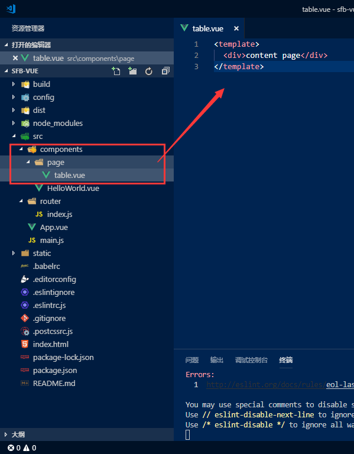

总操作流程：
- 1、删除初始化的一些文件
- 2、创建两个vue文件
- 3、修改router.vue文


-------

# 删除初始化的一些文件


- 项目结构：



- 代码结构：


# 创建两个vue文件

- index.vue

```
<template>
  <div>index page</div>
</template>
```
- content.vue

```
<template>
  <div>content page</div>
</template>
```
# 修改router.vue文件
```
import Vue from 'vue'
import Router from 'vue-router'
import Index from '@/page/index'
import Content from '@/page/content'

Vue.use(Router)

export default new Router({
  routes: [
    {
      path: '/',
      component: Index
    }, {
      path: '/content/:id',
      component: Content
    }
  ]
})
```
