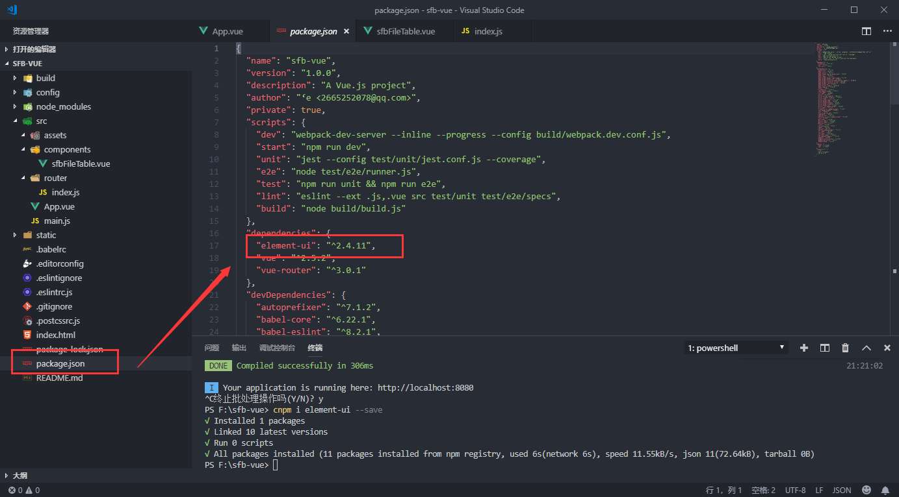
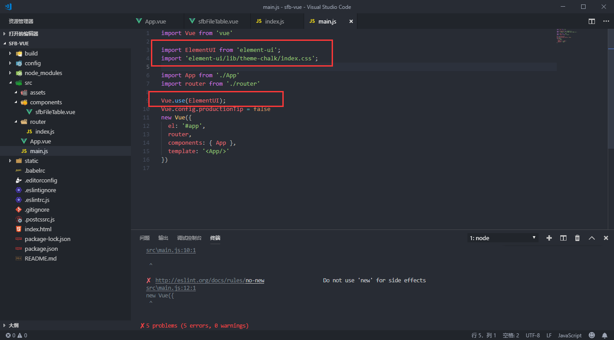

总操作流程：
- 1、[下载安装饿了么组件](#vue.js-01)
- 2、[项目中引用](#vue.js-02)
- 3、[看效果](#vue.js-03)

***
 
 # <a name="vue.js-01" href="#" >下载安装饿了么组件</a>
> 1、创建vue项目后，开启的服务器，要退出

```
快捷键：Ctrl+C
```

>2、在项目文件路径下进行命令，将组件安装到项目中

 ```
 cnpm i element-ui --save
 ```

 - 成功标志




 # <a name="vue.js-02" href="#" >项目中引用</a>

 >在main.js中引用，在App上导入

 

 ```js
import ElementUI from 'element-ui';
import 'element-ui/lib/theme-chalk/index.css';
 ```

 ```js
 Vue.use(ElementUI)
 ```

 # <a name="vue.js-03" href="#" >看效果</a>

> 1、写入组件代码

> 2、运行项目
```shell
cnpm run dev
```

> 3、浏览器进入：http://localhost:8080看效果

