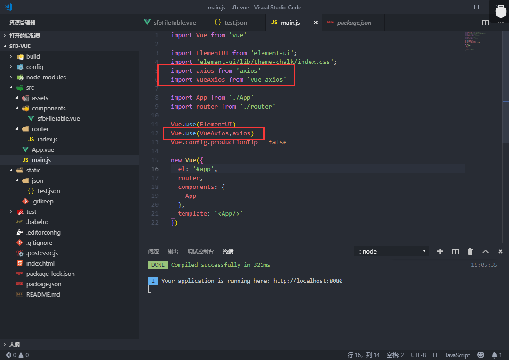

总操作流程：
- 1、下载安装
- 2、引用使用
- 3、看效果

***

- 注意：该教程结合vue-axios使用

# 下载安装

>1、开启的服务器，要退出

```
快捷键：Ctrl+C
```

> 2、下载安装
```
cnpm install axios --save

cnpm install vue-axios --save
```

- 成功标志


# 引用使用

 >1、在main.js中引用，在App上导入

 ```
import axios from 'axios'
import VueAxios from 'vue-axios'
 ```

 ```
 Vue.use(VueAxios,axios)
 ```



 - 2、组件中使用


```
<script>
  export default {
  
    name: 'sfbFileTableModule',
  
    data() {
  
      return {
  
        tableData: []
  
      }
  
    },
    mounted: function(){
        //console.log(this.axios.get);
        this.getJson();
    },
    methods: {
      getJson(){
        this.axios.get('static/json/test.json')
        .then((response)=>{
            console.log(response.data);
        }).catch((response)=>{
            console.log(response);
        })
      }
    }
  
  }
</script>
```


# 看效果

