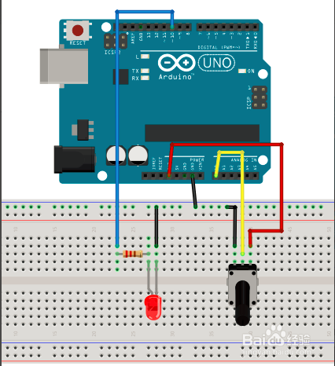

总操流程：
- 1、[各器件链接](#arduino-01)
- 2、[写入程序](#arduino-02)
- 3、[测试](#arduino-03)

----------
# <a name="arduino-01" href="#" >各器件链接</a>

# <a name="arduino-02" href="#" >写程序</a>
```c
void setup()
{
  pinMode(10,OUTPUT);          //数字口要选择带#号的具有pwm功能的输出口
}

void loop()
{
  int n = analogRead(A0);     //读取A0模拟口的数值（0-5V 对应 0-1204取值）
  analogWrite(10,n/4);         //PWM最大取值255  所以将模拟口的取值n除以4
}
```
# <a name="arduino-03" href="#" >测试</a>
`转动电位器可以看到led亮度`