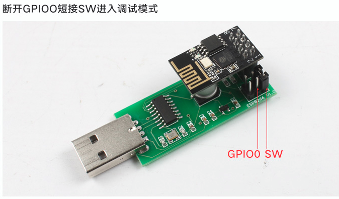

总操作流程：
- 1、[制作服务端](#ESP8266-01)
- 2、[各器件链接](#ESP8266-02)
- 3、[C/S双端数据交互](#ESP8266-03)

> 该教程基于：烧录安信可AT固件

***

# <a name="ESP8266-01" href="#" >制作服务端</a>

> 串口/网络助手调试

[](https://pan.baidu.com/s/1m5MAc4ZON0x-nsT-WQAr7g)


> 制作服务端

- 制作服务端


- 测试


# <a name="ESP8266-02" href="#" >各器件链接</a>



# <a name="ESP8266-03" href="#" >C/S双端数据交互</a>

> 网络助手输入命令

- 连接


- 输入命令

```shell
# 恢复到初始状态
AT+RESTORE

# 设置WiFi应用模式为Station模式
AT+CWMODE=1

# 加入到路由
AT+CWJAP_DEF="TP-LINK888","QwE@123@*~*"

# 设置连接模式，0代表单一连接(只有0能设置透传)，1代表多连接
AT+CIPMUX=0

//设置为透传模式
AT+CIPMODE=1

# 建立远程TCP连接
AT+CIPSTART="TCP","192.168.0.101",8234

# 启动发送
AT+CIPSEND
```

- 开启透传后的双端数据交互


```shell

# 取消发送
+++
```


