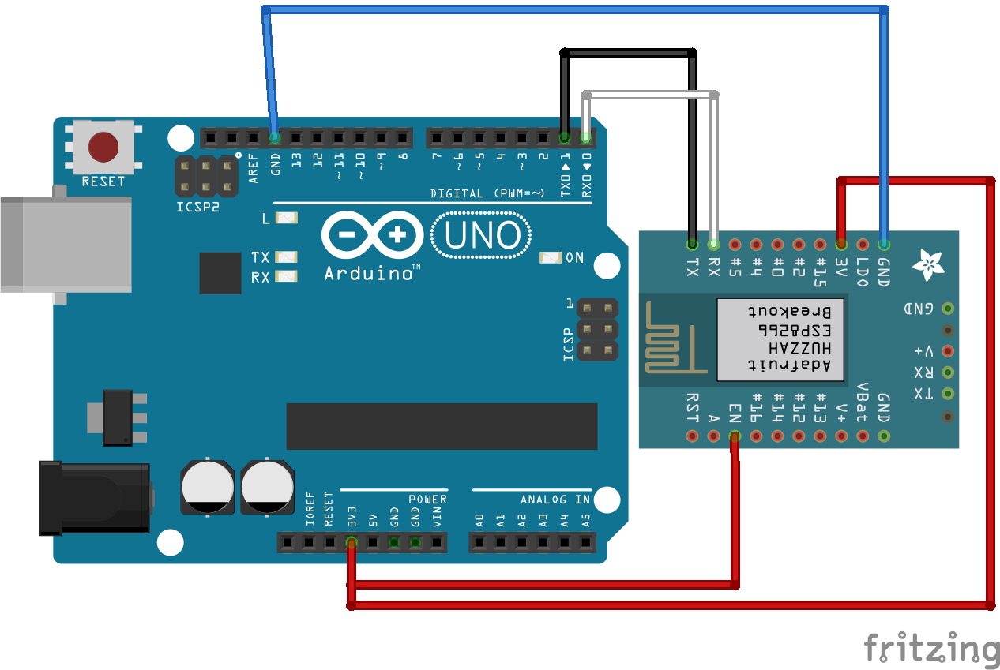

总操作流程：
- 1、[各器件链接](#ESP8266-01)
- 2、[写代码](#ESP8266-02)
- 3、[测试](#ESP8266-03)

> 该教程基于：客户端和服务端双端数据交互

***

# <a name="ESP8266-01" href="#" >各器件链接</a>



# <a name="ESP8266-02" href="#" >写代码</a>

```c
#include <SoftwareSerial.h>
SoftwareSerial softSerial(1, 0);//RX=1 TX=2
String str="";
 /**
 * 写AT命令，连接服务器
 */
  void setAT(){
  softSerial.println("AT+RESTORE");//设置完之后重启
  delay(3000);
  softSerial.println("AT+CWMODE=1");//将8266设置为STA模式
  delay(3000);
  softSerial.println("AT+CWJAP_DEF=\"TP-LINK888\",\"QwE@123@*~*\"");//8266连接路由器发出的WiFi
  delay(3000);
  softSerial.println("AT+CIPMUX=0");//启动多连接
  delay(3000);
  softSerial.println("AT+CIPMODE=1");//设置透传
  delay(3000);
  softSerial.println("AT+CIPSTART=\"TCP\",\"192.168.0.101\",8234");//通过协议、IP和端口连接服务器
  delay(3000);
  softSerial.println("AT+CIPSEND");//启动发送
  delay(3000);
  softSerial.println("Connection Successful");//发送数据
  delay(3000);
 }

void setup() {
  softSerial.begin(115200);
  setAT();
  Serial.begin(115200);
}

void loop() {
  //发送信息
  if (Serial.available() > 0){
    String str=Serial.readString();
    softSerial.print(str);
  }
  str=softSerial.readString();
  Serial.println(str);
  //接收信息
  if ( str.length() > 0){
      String str=softSerial.readString();
      Serial.print(str);
  }
  str = "";
}
```

# <a name="ESP8266-03" href="#" >测试</a>