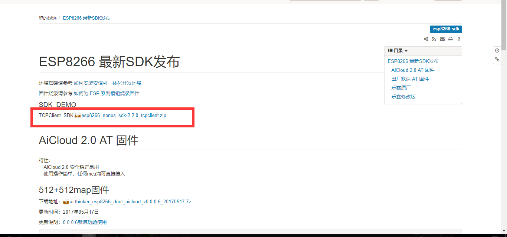
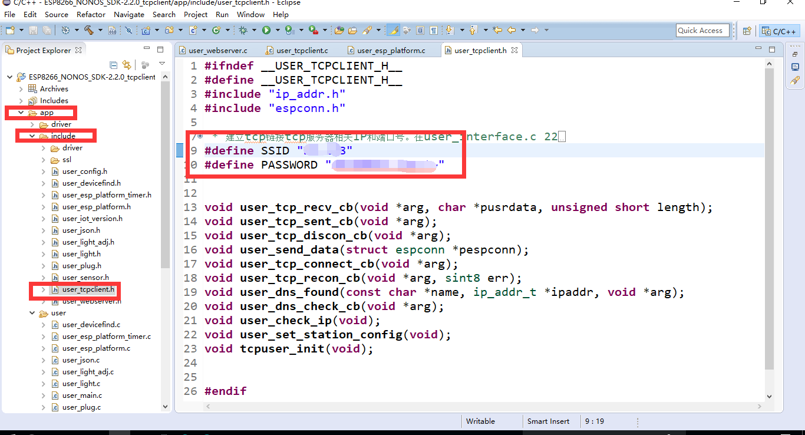
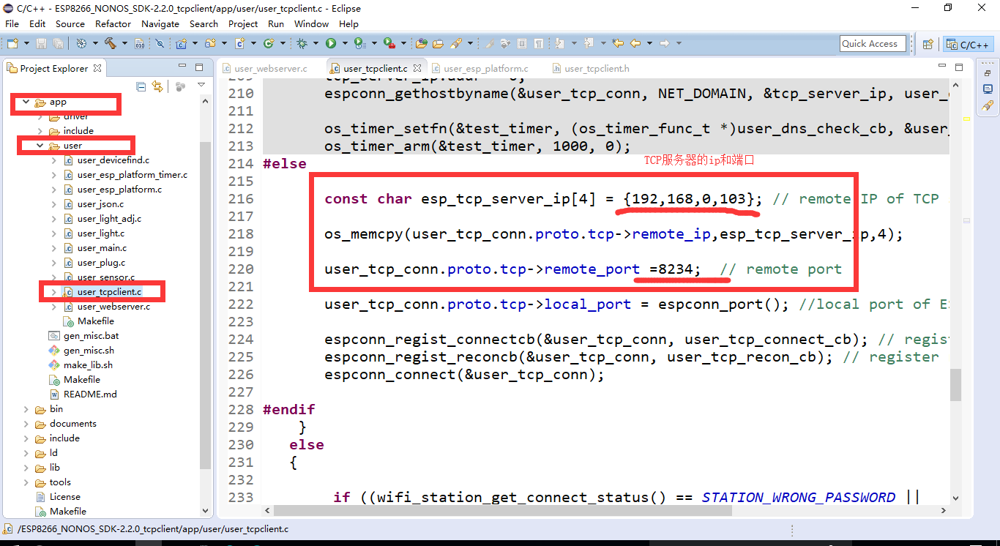
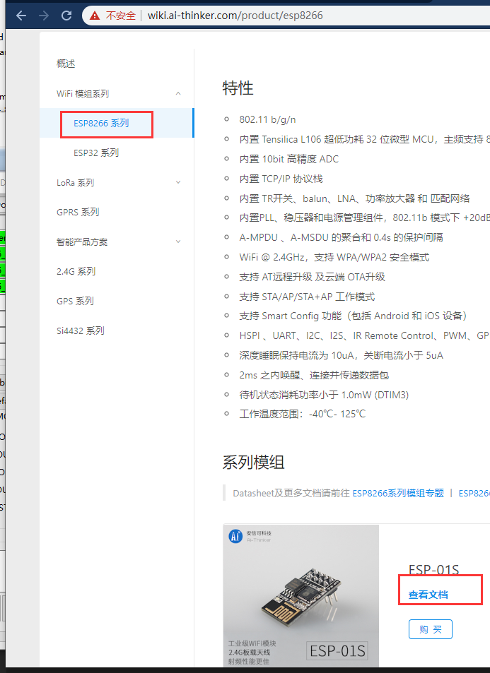
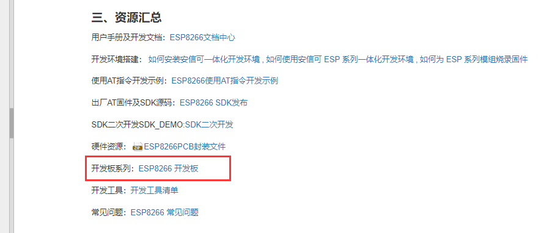
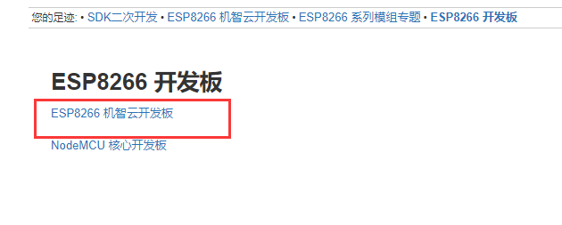
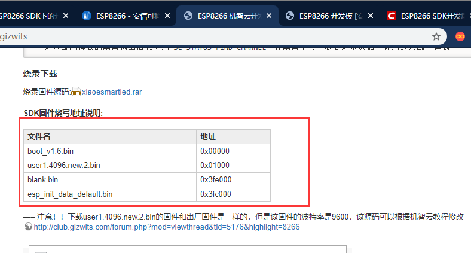
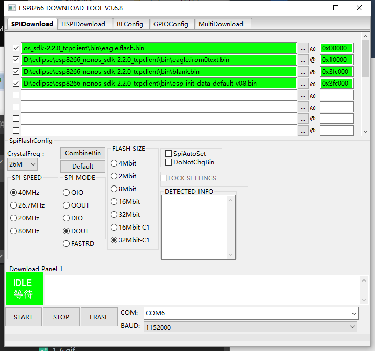
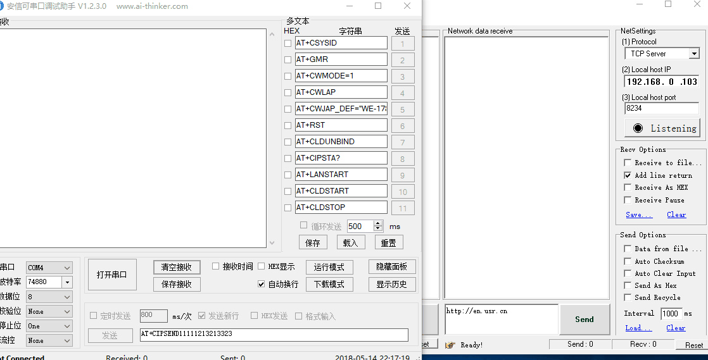

`注意：此教程不能发送信息到服务器，只能接收来自服务器的数据`
总操作流程：
- 1、[下载固件](#ESP8266-01)
- 2、[修改文件](#ESP8266-02)
- 3、[烧写测试](#ESP8266-03)

***
# <a name="ESP8266-01" href="#" >下载固件</a>

# <a name="ESP8266-02" href="#" >修改文件</a>
- user_tcpclient.h
修改成路由WiFi和密码，作用：加入到路由器

- user_tcpclient.c
修改成要链接的TCP服务器

# <a name="ESP8266-03" href="#" >烧写测试</a>

> 我的WiFi模块是：esp8266-01

[]https://wiki.ai-thinker.com/product/overview)

- 烧写

- 测试

