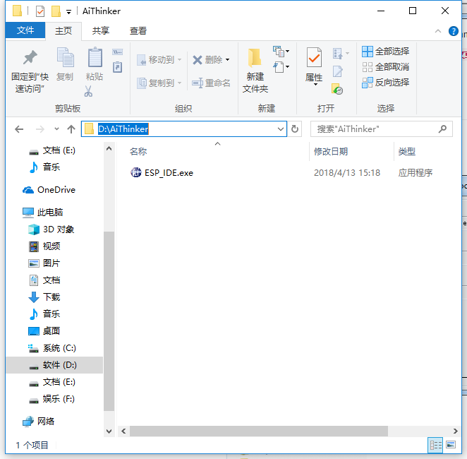
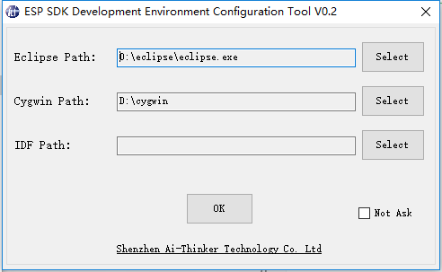

总操作流程：
- 1、[下载安装开发软件](#ESP8266-01)
- 2、[配置开发环境](#ESP8266-02)
    - 2.[1、将ESP_IDE.exe移到新建文件夹AiThinker下](#ESP8266-02-01)
    - 2.[2、点击ESP_IDE.exe配置刚安装的路径](#ESP8266-02-02)
- 3、[测试](#ESP8266-03)

----------
# <a name="ESP8266-01" href="#" >下载安装开发软件</a>

# <a name="ESP8266-02" href="#" >配置开发环境</a>
### <a name="ESP8266-02-01" href="#" >1、将ESP_IDE.exe移到新建文件夹AiThinker下</a>

### <a name="ESP8266-02-02" href="#" >2、点击ESP_IDE.exe配置刚安装的路径</a>

# <a name="ESP8266-03" href="#" >测试</a>
ESP_IDE配置成功后，会自动打开eclipse的表示成功
