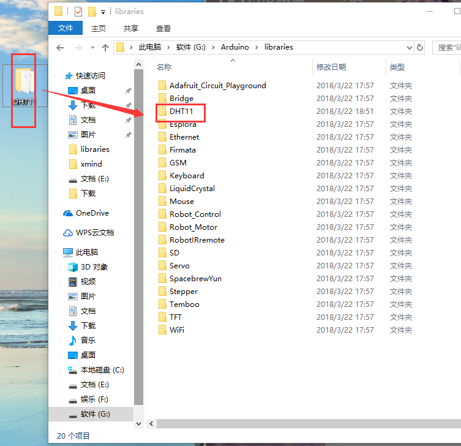

总操流程：
- 1、各器件链接
- 2、使用函数库
- 3、测试

----------
# 各器件链接
`DTH11的引脚说明`
| pin | 名称 | 注释 |
| :-: | :-: | :-: |
| 1 | VDD| 供电3~5.5VDC |
| 2 | DATA | 串行数据，单总线 |
| 3 | NC | 空脚，请悬空 |
| 4 | GND | 接地，电源负极 |

# 使用函数库

解压复制到

使用

# 测试
