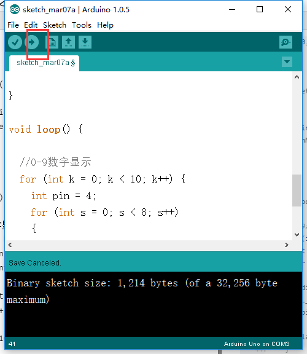

总操流程：
- 1、各器件链接
- 2、写入程序
- 3、测试

----------
链接各个器件

# 写程序
```
byte DIGITAL_DISPLAY[10][8] = { //设置0-9数字所对应数组

{ 1,0,0,0,0,1,0,0 }, // = 0

{ 1,0,0,1,1,1,1,1 }, // = 1

{ 1,1,0,0,1,0,0,0 }, // = 2

{ 1,0,0,0,1,0,1,0 }, // = 3

{ 1,0,0,1,0,0,1,1 }, // = 4

{ 1,0,1,0,0,0,1,0 }, // = 5

{ 1,0,1,0,0,0,0,0 }, // = 6

{ 1,0,0,0,1,1,1,1 }, // = 7

{ 1,0,0,0,0,0,0,0 }, // = 8

{ 1,0,0,0,0,0,1,0 } // = 9

};

void setup() { //设定4-11号数字端口为输出

  for(int i=4;i<=11;i++){
    pinMode(i, OUTPUT);
  }

}

void loop() {

  //0-9数字显示
  for (int k = 0; k < 10; k++) {
    int pin = 4;
    for (int s = 0; s < 8; s++)
    {
      digitalWrite(pin, DIGITAL_DISPLAY[k][s]);
      pin++;
    }
    delay(1000);
  }

}
```
# 测试
