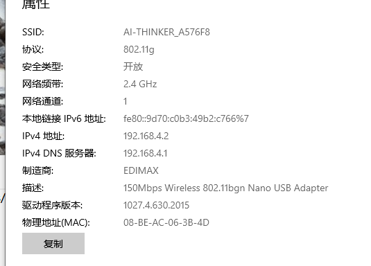

总操作流程：
- 1、[下载sdk](#ESP8266-01)
- 2、[修改文件夹名和文件夹的位置](#ESP8266-02)
- 3、[eclipse导入文件](#ESP8266-03)
- 4、[编译项目](#ESP8266-04)

----------

# <a name="ESP8266-01" href="#" >下载sdk</a>

# <a name="ESP8266-02" href="#" >修改文件夹名和文件夹的位置</a>
### 1、解压得到文件将目录下的 driver_lib 重命名为 app
### 2、拷贝 /examples/IoT_Demo 下的所有文件到刚才的 app 目录（提示覆盖则确认）
### 3、将 ESP8266_RTOS_SDK-2.0.0/third_party/Makefile 重命名为 Makefile.bak
# <a name="ESP8266-03" href="#" >clipse导入文件</a>

# <a name="ESP8266-04" href="#" >编译项目</a>

- 成功标志（bin文件夹下是编译生成的固件）：

> 连接WiFi后，可以获取其ip，浏览器输入ip修改账号密码等操作

