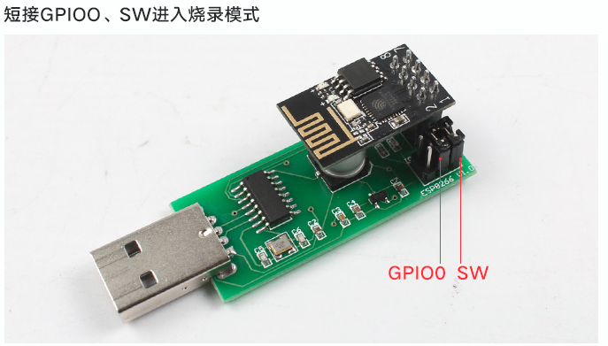

总操作流程：
- 1、[下载固件](#ESP8266-01)
- 2、[下载烧录工具](#ESP8266-02)
- 3、[esp8266链接usb转串口](#ESP8266-03)
- 4、[烧录](#ESP8266-04)
- 5、[测试](#ESP8266-05)

----------
# <a name="ESP8266-01" href="#" >下载固件</a>

# <a name="ESP8266-02" href="#" >下载烧录工具</a>

# <a name="ESP8266-03" href="#" >esp8266链接usb转串口</a>

# <a name="ESP8266-04" href="#" >烧录</a>

# <a name="ESP8266-05" href="#" >测试</a>

> 连接WiFi后，可以获取其ip，浏览器输入ip修改账号密码等操作

测试工具测试

