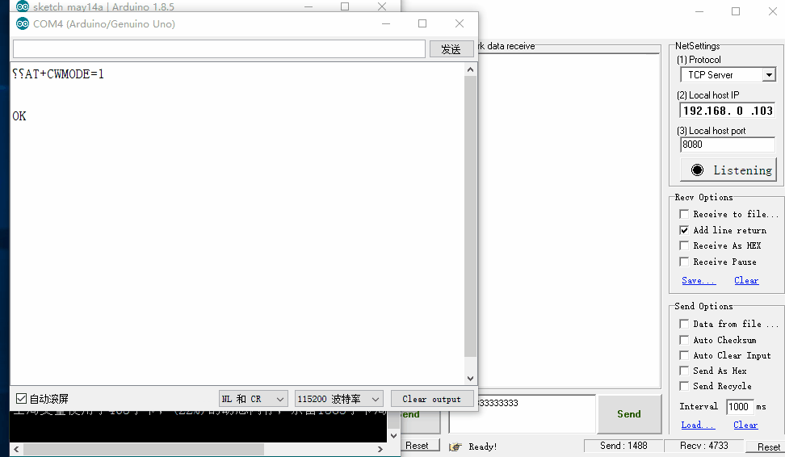

总操作流程：

- 1、[接收服务发送来的信息](#ESP8266-01)
    - 1.1、[各器件链接](#ESP8266-01-01)
    - 1.2、[写入程序](#ESP8266-01-02)
    - 1.3、[测试](#ESP8266-01-03)
- 2、[向服务发送信息](#ESP8266-02)
    - 2.1、[各器件链接](#ESP8266-02-01)
    - 2.2、[写入程序](#ESP8266-02-02)
    - 2.3、[测试](#ESP8266-02-03)
***

8266作为TCP客户端

# <a name="ESP8266-01" href="#" >接收服务发送来的信息</a>
### <a name="ESP8266-01-01" href="#" >各器件链接</a>

### <a name="ESP8266-01-02" href="#" >写入程序</a>
`注意：上传代码的时候断开RX和TX的连接，完成后接回`

```
#include <SoftwareSerial.h>
SoftwareSerial getData(0, 1);//esp8266-01的TX对应开发板的RX，esp8266-01的RX对应开发板的TX

void setup() {
  getData.begin(115200);
  getAT();
  Serial.begin(115200);
}

void loop() {
  if (getData.available() > 0){
      String str=getData.readString();
      Serial.println(str);
  }
}
void getAT(){
  getData.println("AT+CWMODE=1");//将8266设置为STA模式
  delay(3000);
  getData.println("AT+RST");//设置完之后重启
  delay(3000);
  getData.println("AT+CWJAP_DEF=\"WE-178\",\"123456789o\"");//8266连接路由器发出的WiFi
  delay(3000);
  getData.println("AT+CIPMUX=0");//启动多连接
  delay(3000);
  getData.println("AT+CIPSTART=\"TCP\",\"192.168.0.90\",8234");//通过协议、IP和端口连接服务器
  delay(3000);
  getData.println("AT+CIPMODE=1");//设置透传
  delay(3000);
  getData.println("AT+CIPSEND");//启动发送
  delay(3000);
  getData.println("Connection Successful");//发送数据
  delay(3000);
 }
```
### <a name="ESP8266-01-03" href="#" >测试</a>


# <a name="ESP8266-02" href="#" >向服务发送信息</a>
### <a name="ESP8266-02-01" href="#" >各器件链接</a>

### <a name="ESP8266-02-02" href="#" >写入程序</a>
`注意：上传代码的时候断开RX和TX的连接，完成后接回`

```
#include <SoftwareSerial.h>
SoftwareSerial sendData(1, 0);//esp8266-01的RX对应开发板的RX，esp8266-01的TX对应开发板的TX

void setup() {
  sendData.begin(115200);
  sendAT();
  Serial.begin(115200);
}

void loop() {
 if (Serial.available() > 0){
      String str=sendData.readString();
      sendData.println(str);
  }
}

 /**
 * 写AT命令，连接服务器
 */
void sendAT(){
  sendData.println("AT+CWMODE=1");//将8266设置为STA模式
  delay(3000);
  sendData.println("AT+RST");//设置完之后重启
  delay(3000);
  sendData.println("AT+CWJAP_DEF=\"WE-178\",\"123456789o\"");//8266连接路由器发出的WiFi
  delay(3000);
  sendData.println("AT+CIPMUX=0");//启动多连接
  delay(3000);
  sendData.println("AT+CIPSTART=\"TCP\",\"192.168.0.90\",8234");//通过协议、IP和端口连接服务器
  delay(3000);
  sendData.println("AT+CIPMODE=1");//设置透传
  delay(3000);
  sendData.println("AT+CIPSEND");//启动发送
  delay(3000);
  sendData.println("Connection Successful");//发送数据
  delay(3000);
 }

```
### <a name="ESP8266-02-03" href="#" >测试</a>
