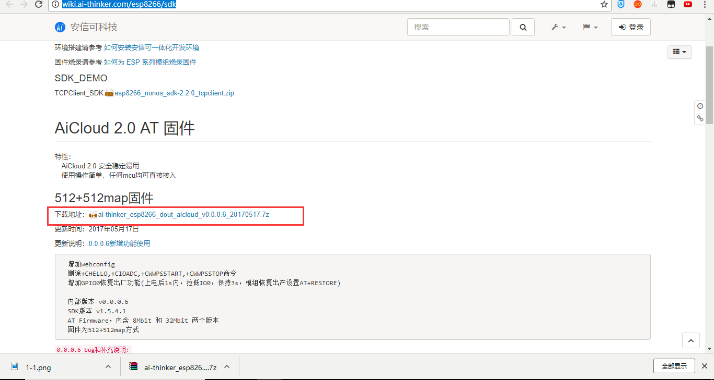
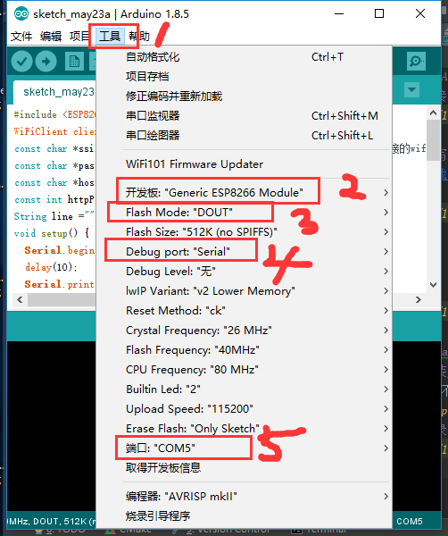
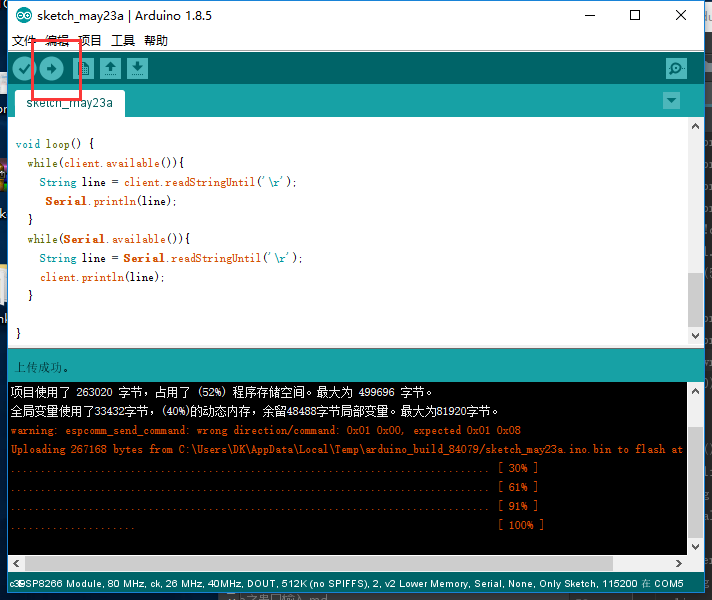
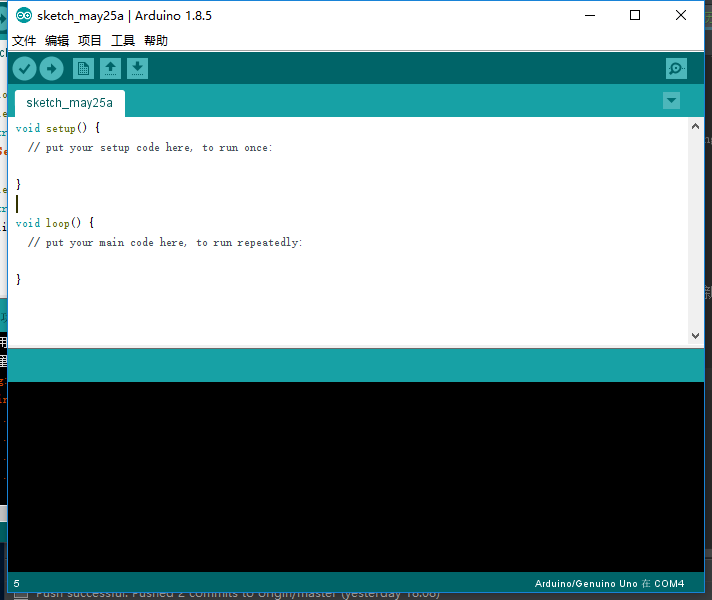
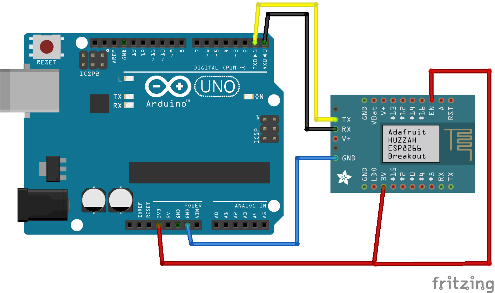

总操作流程：
- 1、[8266烧录AT固件](#ESP8266-01)
    - 1.[1、链接usb转串口](#ESP8266-01-01)
    - 1.[2、烧写固件](#ESP8266-01-02)
- 2、[8266烧录arduino历程](#ESP8266-02)
    - 2.[1、安装arduino的8266环境](#ESP8266-02-01)
    - 2.[2、烧录](#ESP8266-02-02)
- 3、[arduino上传初始状态代码](#ESP8266-03)
- 4、[8266链接arduino](#ESP8266-04)
- 5、[测试](#ESP8266-05)

***

# <a name="ESP8266-01" href="#" >8266烧录AT固件</a>
### <a name="ESP8266-01-01" href="#" >1、链接usb转串口</a>


### <a name="ESP8266-01-02" href="#" >2、烧写固件</a>
[](http://wiki.ai-thinker.com/esp8266/sdk)




`
烧录
`


# <a name="ESP8266-02" href="#" >8266烧录arduino历程</a>
### <a name="ESP8266-02-01" href="#" >1、安装arduino的8266环境</a>
下载时路径不要改，这是对应arduino ide中的路径

[](https://pan.baidu.com/s/1ZAKDMQ9ojpurD2UM8BtwAA)

### <a name="ESP8266-02-02" href="#" >2、烧录</a>




程序
```c
#include <ESP8266WiFi.h>
WiFiClient client;
const char *ssid     = "xxxxx";//要加入的路由WiFi名字
const char *password = "xxxx";//要加入的路由WiFi密码
const char *host = "xxxxx";//服务器IP
const int httpPort =xxxx;//端口号
String line ="";
void setup() {
  Serial.begin(115200);
  delay(10);
  Serial.print("Connecting to ");
  Serial.println(ssid);
  WiFi.begin(ssid, password);
  while (WiFi.status() != WL_CONNECTED) {
    delay(500);
    Serial.print(".");
  }
  Serial.println("");
  Serial.println("WiFi connected");
  Serial.println("IP address: ");
  Serial.println(WiFi.localIP());
  while (!client.connect(host, httpPort)) {
    Serial.println("connection failed");
    delay(500);
  }
  Serial.print("connecting to ");
  Serial.println(host);
  client.write("successfully\r\n");//绑定apikey,修改成你自己的apikey
  delay(10);
}

void loop() {
  while(client.available()){
    String line = client.readStringUntil('\r');
     Serial.println(line);
  }
  while(Serial.available()){
    String line = Serial.readStringUntil('\r');
    client.println(line);
  }

}
```
`
注意：要是上传失败拔出usb转串口重新接上电脑
`


# <a name="ESP8266-03" href="#" >arduino上传初始状态代码</a>




# <a name="ESP8266-04" href="#" >8266链接arduino</a>


# <a name="ESP8266-05" href="#" >测试</a>
[](http://wiki.ai-thinker.com/tools)


