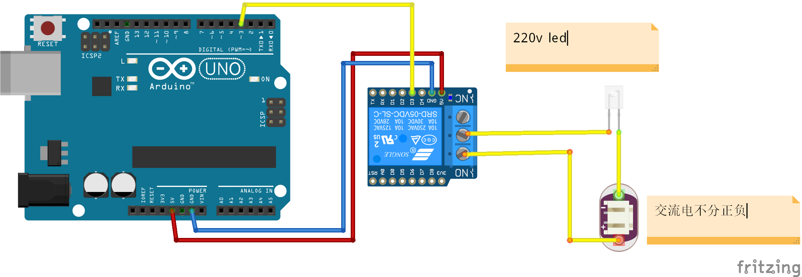

总操流程：
- 1、各器件链接
- 2、写入程序

***

# 各器件链接


# 写入程序
先上传代码，再给led接上220v电

```
#define relay 3 //定义控制光耦继电器为PIN 8  
  
void setup() {  
  pinMode(relay, OUTPUT); //设置PIN 8为输出模式  
}  
  
void loop() {  
  digitalWrite(relay, HIGH);    //给出高电平，光耦吸合  
                                //常开端 与 公共端 接通  
                                //常闭端 与 公共端   断开     
  delay(1000);  
  digitalWrite(relay, LOW);     //给出低电平，光耦离开  
                                //常开端 与 公共端   断开  
                                //常闭端 与 公共端 接通  
  delay(1000);  
}  
```