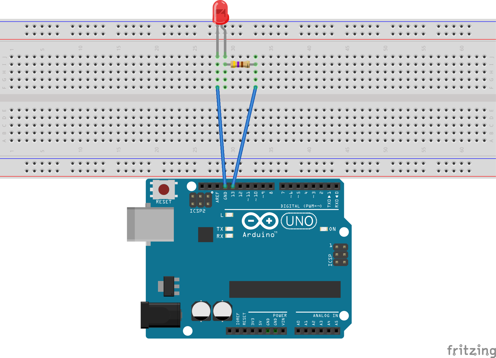

总操流程：
- 1、各器件链接
- 2、写入程序
- 3、测试

----------
# 各器件链接

# 写入程序
```
int led = 13; // 定义针脚号，数字类型为整型
/**
 * 对Arduino电路板或相关状态进行初始化方法
 */
void setup() {
  pinMode(led, OUTPUT); // 设定13号针脚为输出状态，
}
/**
 *  系统调用，无限循环方法
 */
void loop() {
  digitalWrite(led, HIGH);// 向13号针脚输出值为高电压状态，
}
```
###另外一种方式（ardublock图形编程）


# 测试
