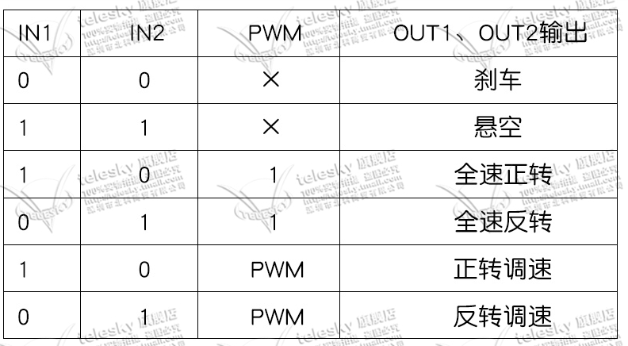
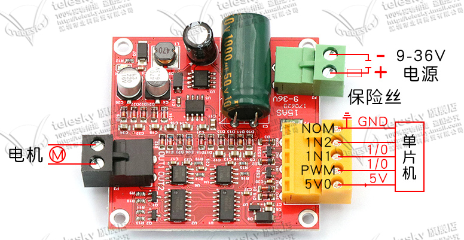
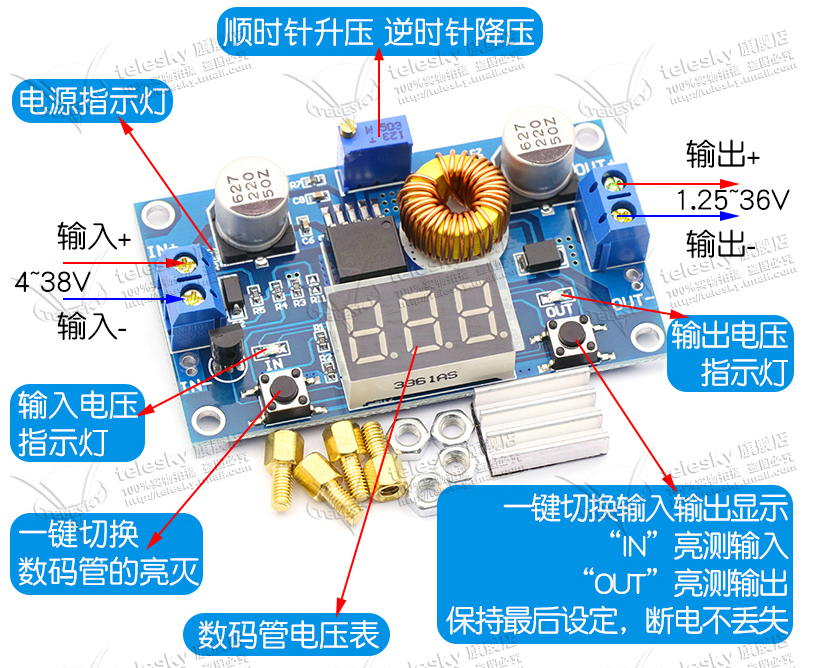
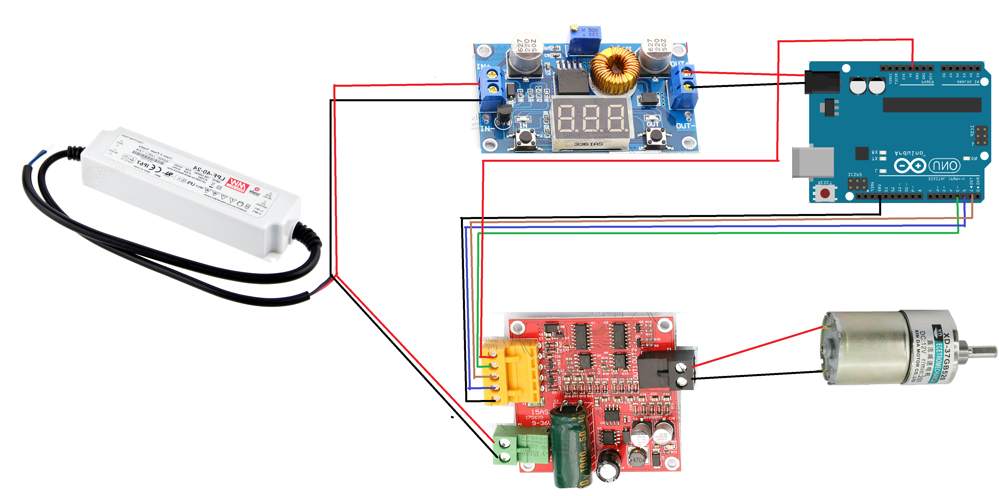

总操作流程：
- 1、[淘宝](#arduino-01)
- 2、[各器件链接](#arduino-02)
- 3、[写入程序](#arduino-03)
- 4、[测试](#arduino-04)

***

# <a name="arduino-01" href="#" >淘宝</a>

> 1、24v减速电机

[](https://item.taobao.com/item.htm?spm=a1z09.2.0.0.585a2e8dfZgRO3&id=25536440394&_u=f24tt1epf352)

> 2、L289驱动模块

[](https://detail.tmall.com/item.htm?id=556008758184&spm=a1z09.2.0.0.585a2e8dfZgRO3&_u=f24tt1epa5b0)

- 说明：





> 3、LM2596S降压模块

[](https://detail.tmall.com/item.htm?id=41307963557&spm=a1z09.2.0.0.585a2e8dfZgRO3&_u=f24tt1epf858)

- 说明：



> 4、明纬LPF-40-24电源

[](https://item.taobao.com/item.htm?spm=a230r.1.14.21.759e7e7cqTL41X&id=564355192554&ns=1&abbucket=8#detail)

# <a name="arduino-02" href="#" >各器件链接</a>



# <a name="arduino-03" href="#" >写入程序</a>

```c
int IN1 = 1;
int IN2 = 2;   
int PWM = 3;  
 
unsigned long time = 1200;
int value = 128;
 
void setup(){
    pinMode(IN1, OUTPUT);
    pinMode(IN2, OUTPUT);
 
    digitalWrite(IN1, HIGH);
    digitalWrite(IN2, LOW);
}
 
void loop(){
    analogWrite(PWM, value);
    delay(time);
}
```

# <a name="arduino-04" href="#" >测试</a>

运行测试